# Magic Menu System for Oqtane Themes

_The cre8magic Menu System helps you create best-practice menus in Oqtane._

> [!TIP]
> A simple top-level menu can be added just like this:
>
> ```html
> <MagicMenu Settings='new() { Pick = "/" }'/>
> ```
>
> ...or if you have a `theme.json` file, all you need is:
>
> ```html
> <MagicMenu Name="MainMenu"/>
> ```

Menus are used in Oqtane solutions as the main way to navigate the user through the website.
A typical website will have a 1️⃣ main menu, 2️⃣ mobile menu, a 3️⃣ footer menu and possibly more.
Each of these menus can have different requirements, such as:

1. **Data Selection**: showing specific pages the top-level pages (main menu), exact IDs (footer) or showing all pages below the current page (sidebar)
1. **Drill-Down**: show a different depth of pages, such as only the first level, or all levels below the current page...
1. **Interactive Behavior**: behaving in a certain way, such as collapsing sub-menus
1. **Look and Feel**: look a certain way, such as highlighting the current page

Doing this all in your own code can be challenging and error-prone, which is why we created the **Magic Menus**.

## Magic Menus TL;DR

The goal is that your menus are:

1. configuration-based - through code or JSON
1. mobile-friendly & reactive
1. ARIA-Accessible
1. use HTML5 and Bootstrap5 conventions
1. respect user permissions
1. highlight the current page
1. easy to customize & flexible

You can work with pre-built components such as **MagicMenu 🧩** or leverage the **MagicMenuKit 🧰** to build your own components.

A very simple Bootstrap5 menu can be added just like this:

```html
@using ToSic.Cre8magic.OqtaneBs5
<MagicMenu Settings='new() { Pick = "/" }'/>
```

## How it Works

The Magic Menu uses the cre8magic conventions.

[!include [](../shared/_magic-process-in-a-nutshell.md)]

Each of these steps can be very simple or very complex, depending on your needs.
What you'll discover is:

1. **Settings ⚙️**: how you can add them directly to the tab, in a central location or even in a JSON file and more.
1. **Preparation Act 🎭**: how all kinds of settings will affect what you see,
    especially once you get into **Tailoring 🧵** and **Blueprints 📘**.
1. **Blazor Code 🔥**: how you can use the pre-built components or build your own,
    especially with the help of the  **MagicMenuKit 🧰**.

## Basic Examples

### Basic Top-Level Menu

#### [Example & Output](#tab/basic1)

Let's start with the most basic setup of all:

1. use the **MagicMenu 🧩 Component** `<MagicMenu>`
1. place all the settings directly into the tag
1. only specify (pick) that we want the top level pages with `/`
1. don't specify any design or behavior, so it will use empty defaults (hence the `OqtaneBasic`)

```html
@using ToSic.Cre8magic.OqtaneBasic
<MagicMenu Settings='new() { Pick = "/" }'/>
```

The output:

```html
<ul>
  <li>
    <a href="/">Home</a>
  </li>
  <li>
    <a href="/about">About</a>
  </li>
  <li>
    <a href="/contact">Contact</a>
  </li>
</ul>
```

#### [Code Explained](#tab/basic2)

This code explained:

```html
@using ToSic.Cre8magic.OqtaneBasic
<MagicMenu Settings='new() { Pick = "/" }'/>
```

1. `@using ToSic.Cre8magic.OqtaneBasic` tells Blazor that we want to use these controls.
1. `...OqtaneBasic` is the namespace for controls without special presets.
1. `<MagicMenu .../>` is a Blazor component provided by **cre8magic ♾️**
1. The `Settings="..."` attribute is a parameter which is passed to the component.
    1. It expects a [](xref:ToSic.Cre8magic.Menus.MagicMenuSettings) object.
    1. Since Blazor knows the expected type, you can shorten it as `new() { ... }`.
    1. The `Pick` determines what pages to show in this menu.
    In this case, it's only the top-level pages, specified by `/` (`/+` would get level 1 & 2).

#### [What Happens](#tab/basic3)

Here's what actually happens under the hood:

1. The **MagicMenu Component 🧩** will take
    1. the parameters
    1. and the Oqtane 🩸 `PageState`
1. them pass them to the **MagicAct 🎭**, which will get an internal _MagicMenuService_ to:
    1. mix in default settings which were not specified, such as `Show=True`
    1. retrieve the [MagicPages](xref:ToSic.Cre8magic.Pages.IMagicPage) as specified by the `Pick` parameter - in this case all 1st-level pages
    1. build a **MagicMenuKit 🧰** which contains the pages and some tools to easily create the menu
1. Then the **MagicMenu Component 🧩** will use the **MagicMenuKit 🧰** to create the desired **HTML 🌐**.

> [!TIP]
> The **MagicMenuComponent 🧩** will run various loops etc.
> combining the pages and the blueprint to create the HTML.
> This could also be your custom code.


---

### Basic 1st and 2nd Level Menu

#### [Example & Output](#tab/basic-2-level-menu1)

Let's add a bit more complexity by showing level 1 and 2

```html
@using ToSic.Cre8magic.OqtaneBasic
<MagicMenu Settings='new() { Pick = "/+" }'/>
```

The output:

```html
<ul>
  <li>
    <a href="/">Home</a>
  </li>
  <li>
    <a href="/about">About</a>
    <ul>
      <li>
        <a href="/about/team">Team</a>
      </li>
      <li>
        <a href="/about/history">History</a>
      </li>
  </li>
  <li>
    <a href="/contact">Contact</a>
  </li>
</ul>
```

#### [What Happens](#tab/basic-2-level-menu2)

The `Pick` instructions are a concise way to specify almost all common scenarios.

The `Pick = "/+"` means that we want to start at the root and show all pages on the first and next level.

For further samples, read on...

---


### Basic Tailoring Example

#### [Example](#tab/basic-tailor1)

Let's just step it up a bit because we want to add some common classes to the various tags.
Specifically we want `navbar-nav` on the `<ul>`, `nav-item` on the `<li>` and `nav-link` on the `<a>`,
and `active` on the current node.

```razor
@using ToSic.Cre8magic.OqtaneBasic
<MagicMenu Settings='new() { Pick = "/", Blueprint = SimpleBlueprint() }'/>
@code
{
  MagicMenuBlueprint SimpleBlueprint() => new()
  {
    Parts = new()
    {
      { "ul", new() { Classes = "navbar-nav" } },
      { "li", new() { Classes = "nav-item", IsActive = new("active") } },
      { "a", new() { Classes = "nav-link" } },
    }
  };
}
```

> [!TIP]
> Normally the `Blueprint` would be defined in a central location, so you can reuse it in multiple places.

#### [Output](#tab/basic-tailor2)

Now the output is getting more realistic (also note the `active` on the first item).

```html
<ul class="navbar-nav">
  <li class="nav-item active">
    <a class="nav-link" href="/">Home</a>
  </li>
  <li class="nav-item">
    <a class="nav-link" href="/about">About</a>
  </li>
  <li class="nav-item">
    <a class="nav-link" href="/contact">Contact</a>
  </li>
</ul>
```

#### [What Happens](#tab/basic-tailor3)

Most of this is very similar to the previous example, this is new:

1. The function `SimpleBlueprint()` is used to create a **MagicMenuBlueprint 📘**
    1. It specifies that the `<ul>` should get the class `navbar-nav`
    1. The `<li>` should get the class `nav-item` and `active` if it's the current page
    1. The `<a>` should get the class `nav-link`
1. The **MagicMenu Component 🧩** will use this blueprint to customize the output.

...but how does that work, you may ask? 🤔

Internally there is a **MagicTailor 🧵** which will take the **MagicMenuBlueprint 📘** and apply it to the output.
This is a very powerful concept which allows you to customize the output without changing the code.

You'll learn more about the **MagicTailor 🧵** and **MagicMenuBlueprint 📘** later on,
but suffice to know that it's very flexible, but also that your Razor code actually decides what to do with it.

---

## Bootstrap5 Examples


### Menu with Bootstrap5 Defaults

#### [Menu with Bootstrap5 Defaults](#tab/bs5-menu1)

todo


#### [...Explained](#tab/bs5-menu2)

1. It will detect that we want a `Horizontal` menu (default)


---

### Sidebar: Menu Level 2 & 3 Above Current Page

#### [Example & Output](#tab/menu-level-2-above1)

The following Oqtane component will create

1. a sidebar menu showing the second and third levels
1. ...of the page above the current page
1. with collapsing arrows and highlighting the current page

```html
@using ToSic.Cre8magic.OqtaneBs5
<MagicMenu Settings='new() { Pick = ".//2+", Variant = "Vertical" }'/>
```

_for brevity we're excluding the output here, but you can imagine it..._

#### [Explained](#tab/menu-level-2-above2)

Note that this example uses the `OqtaneBs5` namespace.
This will default to common Bootstrap5 classes and behavior.

Because we're using the `Vertical` variant, the output will be built that way.

The `Pick = ".//2+"` is a concise way to specify:

* Start relative to the page above the current page (`.`)
* Show the second level (`//2`)
* ...and all levels below (`+`)


---

## Custom Code Examples

Our goal is to make the controls so flexible, that you will not have to create your own code.
But if you do, it should be easy and powerful.

### Coded Menu Example

#### [Coded Menu Example](#tab/coded-menu1)

This example assumes you want full control over the output, and still want to use the cre8magic engine to reliably get the right pages, permissions and a simpler SOLID API which is more robust than the built in Oqtane API:

```razor
@inherits ComponentBase
@using ToSic.Cre8magic.Act
@using ToSic.Cre8magic.Pages
@inject IMagicAct MagicAct

@code{
  [CascadingParameter] public required PageState PageState { get; set; }
}

@RenderMenu(MagicAct.MenuKit(new() { Pick = "/+", PageState = PageState }).Root)

@code
{
  /// <summary>
  /// Render a Menu - and recursively render sub-menus
  /// </summary>
  /// <returns></returns>
  RenderFragment RenderMenu(IMagicPage current) =>
    @<ul class='my-ul-class'>
      @foreach (var menuPage in current.Children)
      {
        <li class='my-li-class'>
          <a class='my-a-class' href="@menuPage.Link" target="@menuPage.Target">@menuPage.Name</a>
          @if (menuPage.HasChildren)
          {
            <span class='span-stuff'></span>
            @* **RECURSION** *@
            @RenderMenu(menuPage)
          }
        </li>
      }
    </ul>;
}
```

---


### [Menu with Configuration in JSON](#tab/json-menu1)

This example shows how you can configure the menu in a `theme.json` file:

```json
{
  "menus": {
    "sidebar": {
      "start": ".",
      "level": 2,
      "depth": 2
    }
  }
}
```

```html
@using ToSic.Cre8magic.OqtaneBs5
<MagicMenu Name="sidebar"/>
```

_Note that this example skips the part in the theme were the json is loaded and applied._

---


will take the settings and prepare a **Kit** for you using some internal wizardry.
1. The **MagicMenuSettings ⚙️** determine what pages should be shown - like "top-level only"

```mermaid
flowchart LR
    S(["Settings ⚙️ or ...Name <br> (_all optional_)"]) --> PC{"Use <br> Comp. <br> ?"}
    PC -- yes --> MC["MagicMenu 🧩 Component <br> uses 🎭 & 🧰"]
    MC -- get --> MT["Magic Tailor 🧵"]
    MT -- magic 🪄 --> HTML["Blazor HTML 🔥"]
    PC -- no --> MH("Magic Act 🎭 <br> (get MenuKit 🧰)")
    MH --> YC["Your Code 🧑🏽‍💻"]
    YC -- magic 🪄 --> HTML
```




1. **MagicMenuSettings ⚙️** determine what pages should be shown - like "second level only with sub-pages"

1. The **MagicAct 🎭** will take these settings and prepare a **Kit** for you using some internal wizardry.

1. This **MagicMenuKit 🧰** contains the **MagicPages** and various tools to easily create any menu.

1. Some code will then use this kit to create the desired **HTML 🔥**

    1. Either use the pre-built **MagicMenu 🧩** component in **OqtaneBs5** to quickly create a best-practice Bootstrap5 menu

    2. Or create your own Blazor component according to your needs

### How it Works - Advanced Setup with Tailor

If you are using the **MagicMenu 🧩** component,
it can _optionally_ use the **MagicMenuTailor 🧵** to tweak the output in various scenarios without changing your code.
You can also create custom components which use the **MagicTailor 🧵**.
The tailor also needs settings, so this looks a bit like this:

```mermaid
flowchart LR
 subgraph s1["Magic Act 🎭"]
            ls["Load Settings ⚙️"]
        n1["Load Blueprints 📘<br>&amp; Magic Tailor 🧵"]
        gk["Provide Kit 🧰
        with Tailor 🧵"]
  end
    YC["<b>Component / Code &lt; / &gt;</b><br>Using 🧰 / 🧵"] -- magic 🪄 --> HTML["Blazor HTML 🔥"]
    ls --> n1
    n1 --> gk
    s1 --> YC
    S(["Settings ⚙️ or ...Name <br> (_all optional_)"]) --> s1

```



1. The _optional_ **MagicMenuTailor 🧵** is a helper to tweak the output in various scenarios without changing your code.

    1. It is used by the **MagicMenu 🧩** component to allow for easy customization.

    1. You can also create your own **Tailors 🧵** to further customize the output.

1. The _optional_ **MagicMenuBlueprints 📘** are used to configure the **MagicMenuTailor 🧵** to your needs.

    1. For example, you can specify HTML `class` for any tag such as `<ul>`, `<li>`, `<a>`, `<span>`

    1. ...or specify `data-`, `title` or any attributes for special cases

    1. You can also specify conditional classes to add if a node is `active` or _not_ active, is in breadcrumb, etc.

1. The _optional_ **MagicPackageSettings** allows you to configure _everything_ in a central location.
    This can be either in code or in a `theme.json` file.


## Background: The Goals

A core challenge with any website is creating great menus.
There are actually three distinct problems to solve:

1. Managing multiple menus on the same page
    * the main menu
    * possibly a side-menu with sub-pages
    * a footer menu for disclaimer and privacy
    * multiple menus in the footer for mega-footers with many links

1. **Configuration** for selecting the pages which should appear in the menu
    * where to start (like a menu which start at level 2)
    * what pages to show (like all the pages on level 2 - or only their children)
    * how deep to go (do we show submenus?)

1. **Design** for styling of each node based on the context
    * is the current node selected? add `active`...
    * is the current node a parent of the selected node? add `is-parent`...
    * is the current node a dropdown for pages beneath it...

When we designed cre8magic Menus, we wanted to be sure that we're ticking all the right boxes.
So these are the real-life challenges we wanted to solve:

1. **High-Quality Output** following the latest Bootstrap5, accessibility, mobile-friendly and best-practice standards.

1. Make a simple, best-practice API which can be used in code, but can scale up to components and centralized settings.

1. Ensure that the menus are always respecting user permissions and the current page.

1. Allow for easy customization of the output without changing the code.

1. Follow SOLID principles and Composition-over-Inheritance to ensure that the code is maintainable and extendable.


## Magic Menu Settings

These are the main settings.

1. Settings for loading the configuration elsewhere
    1. `Name` - name of the settings to load from the Book under `Menus` (or `menus` in JSON)
1. Settings to specify what to show
    1. `Pick` - where to start, eg. `*` for root, `.` for current page, `42` for page 42
    1. ~~`Tree`~~ (_future_): ability to provide an exact structure of pages in the code for processing
1. Settings to specify how to show
    1. Variant - it is up to the code do determine what do do with this.
        The `MagicMenu` 🧩 currently supports `Vertical` for a sidebar, `Horizontal` for a top menu and will create different outputs like collapsing features.
    1. `Blueprint` - settings for the tailor in the Book configuration under `MenuBlueprints` (or `menuBlueprints` in JSON)
1. Settings to specify Context
    1. PageState - required IF it is not already broadcast by the theme


### Pick Values

Pick determines what pages to retrieve.
It's a concise way to specify what to show.
What you're always doing is:

1. **Start** at a certain page (like `/` for all level-1 or `./` for sub pages of the current page, `42` for page 42)
1. Optionally **Go** to another level, like `//2` for the second level or `.//` for the root above the current page
1. Optionally **drill deeper** into the tree, like `./+` for all children of the current page
1. Optionally **further rules** (CSV), such as `./, 5!` to show the children of the current page and page 5 even if it's not in the real structure

These are accepted values of `Pick` (or `pick` in the JSON):

* `/` root (actually all top-level pages)
* `//` same (not recommended, just for API consistency)
* `//1` same (not recommended, just for API consistency)
* `//2` all second level pages (not typical/recommended, just for API consistency)
* `//3` all third level pages (not typical/recommended, just for API consistency)

* `.` current page
* `./` children of the current page
* `.//` all root nodes above the current page (not useful, like `/`)

* `..` parent of the current page (just that page)
* `../` children of the parent of the current page (this page and siblings)

* `.//2` ancestor of the current page on the second-level
* `.//2/` children of the ancestor of the current page on the second-level

* `..-1` identical to `..`
* `..-2` up two levels

* `42` the page 42
* `42/` children of the page 42
* `5!` the page 5 even if it's normally not visible in a menu
* `42, 5!` combinations thereof


## Magic Menu Blueprints

This is one of the most sophisticated bits of the JSON settings.
You can configure this in the `menuBlueprints` section of the JSON.
Note that this uses the [Magic Classes with Tokens](xref:Cre8magic.Library.MagicTailor.Index).
Example:

```jsonc
"menuBlueprints": {
  "Mobile": {
    "ul": {
      "byLevel": {
        "1": "navbar-nav",
        "-1": "collapse theme-submenu-[Menu.Id]-[Page.Id]"
      },
      "inBreadcrumb": "show"
    },
    "li": {
      "classes": "nav-item nav-[Page.Id] position-relative",
      "hasChildren": "has-child",
      "isActive": "active",
      "isDisabled": "disabled"
    },
    "a": {
      "classes": "nav-link mobile-navigation-link",
      "isActive": "active"
    },
    "span": {
      "classes": "nav-item-sub-opener",
      "inBreadcrumb": [ null, "collapsed" ]
    },
    // Special target information (not really styling) usually on the span-tag
    "data-bs-target": ".theme-submenu-[Menu.Id]-[Page.Id]"
  },
}
```

This means a lot of things, but let's highlight some aspects:

1. the surrounding `<ul>` tag will get the `navbar-nav` class at the first level; all others will get `collapse` and others
1. the `<ul>` will also get a menu and page specific class because of the `theme-submenu-[Menu.Id]-[Page.Id]` which is useful for the collapse identification in bootstrap
1. the `<li>` of each node will get some classes including an `active` if it's the current page, and `has-child` if it has children so that the bootstrap menu will do it's magic
1. the `<a>` link itself will also have different classes based on active
1. the `<span>` is used to show a `+`/`-` indicator using the `nav-item-sub-opener`
1. ...and it will also get's `collapsed` if it's not in the breadcrumb (so it's only opened if a sub-page is the current page)
1. and a special attribute used by bootstrap `data-bs-target` will have the same contents as the identifying class of the surrounding `<ul>` to ensure bootstrap will work


---
---
---

===


## Manage Multiple Menus

The MagicMenu gives each menu a name, such as `Main`, `Sidebar`, `Footer` etc.
You can determine these names in the Razor files.

Each of these menus can then be configured in the [JSON](xref:Cre8magic.Library.ThemeSettings.Index).
By default, each menu will find it's **configuration** and it's **design**
based on the same name.
So the `Main` menu would take the configuration and design called `Main`.

But you can also reconfigure this.
For example, you could say that the Theme `Sidebar` will use
the configuration `TopLevelOnly` for the `Main` menu.
This is configured in the `parts` of the `themes` section of the JSON file.

---

## Missing Features

1. As of now you cannot filter out (exclude) specific pages.
  For this you would still need to write your own code or construct your nav-tree for special cases.
1. You cannot link to page in another language, as Oqtane doesn't really have this concept yet.

## History

1. Added in v0.0.1 2022-10 with 80% coverage of what DDR Menu had in DNN
