# cre8magic – Magic Menu System for Oqtane Themes

> [!TIP]
> Menus are really simple to build yourself - not 😠!
>
> Not if you want them to be reactive, mobile-friendly, accessible, Bootstrap5 standard...
> and you want the footer menus to only show certain pages...
> ...and the side menu to use different styling...
>
> And you want to use best-practice SOLID principles
> and have fun maintaining changes.

## About Magic Menus

The cre8magic Menus are a system to easily create best-practice menus in Oqtane Themes.
Depending on your preferences you can use pre-built components and some configuration,
or easily build your own components with the help of the **MagicMenuKit**.

A very simple menu can be added just like this:

```html
@using ToSic.Cre8magic.OqtaneBs5
<MagicMenu Settings='new() { Start = "/" }'/>
```

## How it Works

### How it Works - Basic Setup

The Magic Menu is a system to create menus in Oqtane Themes.
It uses the standard conventions of cre8magic with the following setup:

```mermaid
flowchart LR
    S(["Settings ⚙️ or ...Name <br> (_all optional_)"]) --> PC{"Use <br> Comp. <br> ?"}
    PC -- yes --> MC["MagicMenu 🎁 Component <br> uses 🎩 & 🧰"]
    MC -- get --> MT["Magic Tailor 🧵"]
    MT -- magic 🪄 --> HTML["Blazor HTML 🔥"]
    PC -- no --> MH("Magic Hat 🎩 <br> (get MenuKit 🧰)")
    MH --> YC["Your Code 🧑🏽‍💻"]
    YC -- magic 🪄 --> HTML
```

<!-- use https://www.mermaidchart.com/play to edit -->



1. **MagicMenuSettings ⚙️** determine what pages should be shown - like "second level only with sub-pages"

1. The **MagicHat 🎩** will take these settings and prepare a **Kit** for you using some internal wizardry.

1. This **MagicMenuKit 🧰** contains the **MagicPages** and various tools to easily create any menu.

1. Some code will then use this kit to create the desired **HTML 🔥**

    1. Either use the pre-built **MagicMenu** component in **OqtaneBs5** to quickly create a best-practice Bootstrap5 menu

    2. Or create your own Blazor component according to your needs

### How it Works - Advanced Setup with Tailor

If you are using the **MagicMenu** component,
it can also use the **MagicMenuTailor 🧵** to tweak the output in various scenarios without changing your code.
You can also create custom components which use the **MagicTailor 🧵**.
The tailor also needs settings, so this looks a bit like this:

```mermaid
flowchart LR
 subgraph s1["Magic Hat 🎩"]
            ls["Load Settings ⚙️"]
        n1["Load Tailor Settings<br>&amp; Magic Tailor 🧵"]
        gk["Provide Kit 🧰
        with Tailor 🧵"]
  end
    YC["<b>Component / Code &lt; / &gt;</b><br>Using 🧰 / 🧵"] -- magic 🪄 --> HTML["Blazor HTML 🔥"]
    ls --> n1
    n1 --> gk
    s1 --> YC
    S(["Settings ⚙️ or ...Name <br> (_all optional_)"]) --> s1

```



1. The _optional_ **MagicMenuTailor 🧵** is a helper to tweak the output in various scenarios without changing your code.

    1. It is used by the **MagicMenu 🎁** component to allow for easy customization.

    1. You can also create your own **Tailors** to further customize the output.

1. The _optional_ **MagicMenuTailorSettings** are used to configure the **MagicMenuTailor** to your needs.

    1. For example, you can specify HTML `class` for any tag such as `<ul>`, `<li>`, `<a>`, `<span>`

    1. ...or specify `data-`, `title` or any attributes for special cases

    1. You can also specify conditional classes to add if a node is `active` or _not_ active, is in breadcrumb, etc.

1. The _optional_ **MagicPackageSettings** allows you to configure _everything_ in a central location.
    This can be either in code or in a `theme.json` file.

## Intro Examples

### 1. Simple Top-Level Menu

This bit of blazor code will create a Bootstrap5 top-level menu with the default settings,
respecting user permissions and highlighting the current page:

```html
@using ToSic.Cre8magic.OqtaneBs5
...
<MagicMenu Settings='new() { Start = "/" }'/>
...
```

TODO: PIC of output

### 2. Simple Sidebar Menu

The following Oqtane component will create a sidebar menu showing the second and third levels
with collapsing arrows and highlighting the current page:

```html
@using ToSic.Cre8magic.OqtaneBs5
<MagicMenu Settings='new() { Start = ".", Level = 2, Depth = 2, Variant = "Vertical" }'/>
```

TODO: PIC of output

### 3. Coded Menu

This example assumes you want full control over the output, and still want to use the cre8magic
engine to reliably get the right pages, permissions and a simpler SOLID API which is more robust than the
built in Oqtane API:

```csharp
TODO:
```

### 4. Menu with Configuration in JSON

This example shows how you can configure the menu in a `theme.json` file:

```json
{
  "menus": {
    "sidebar": {
      "start": ".",
      "level": 2,
      "depth": 2
    }
  }
}
```

```html
@using ToSic.Cre8magic.OqtaneBs5
<MagicMenu SettingsName="sidebar"/>
```

_Note that this example skips the part in the theme were the json is loaded and applied._

## Challenges and Goals

When we designed cre8magic Menus, we wanted to be sure that we're ticking all the right boxes.
So these are the real-life challenges we wanted to solve:

1. **High-Quality Output** following the latest Bootstrap5, accessibility, mobile-friendly and best-practice standards.

1. Make a simple, best-practice API which can be used in code, but can scale up to components and centralized settings.

1. Ensure that the menus are always respecting user permissions and the current page.

1. Allow for easy customization of the output without changing the code.

1. Follow SOLID principles and Composition-over-Inheritance to ensure that the code is maintainable and extendable.


## Settings: MagicMenuSettings

These are the main settings.

1. Settings for loading the configuration elsewhere
    1. PartName - the theme part name which can reference other settings/tailor-settings TODO: link to why you would use this
    1. SettingsName - name of the settings in the full configuration under `Menus` (or `menus` in JSON)
    1. ~~TailorName - name of the tailor to apply WIP~~
    1. TailorSettings - settings for the tailor in the full configuration under `MenuTailorSettings` (or `menuTailorSettings` in JSON)
1. Settings to specify what to show
    1. Start - where to start, eg. `*` for root, `.` for current page, `42` for page 42
    1. Level - how many levels above the start to show, eg. `-1` for one above, `2` for two below
    1. Depth - how many levels below the start to show, eg. `2` for two below
    1. ~~Children~~
1. Settings to specify how to show
    1. Variant - it is up to the code do determine what do do with this.
        The `MagicMenu` currently supports `Vertical` for a sidebar, `Horizontal` for a top menu and will create different outputs like collapsing features.
    1. ~~Design - name of the design to use WIP~~
1. Settings to specify Context
    1. PageState - required IF it is not already broadcast by the theme


---
---
---

===

A core challenge with any website is creating great menus.
There are actually three distinct problems to solve:

1. Managing multiple menus on the same page
    * the main menu
    * possibly a side-menu with sub-pages
    * a footer menu for disclaimer and privacy
    * multiple menus in the footer for mega-footers with many links

1. **Configuration** for selecting the pages which should appear in the menu
    * where to start (like a menu which start at level 2)
    * what pages to show (like all the pages on level 2 - or only their children)
    * how deep to go (do we show submenus?)

1. **Design** for styling of each node based on the context
    * is the current node selected? add `active`...
    * is the current node a parent of the selected node? add `is-parent`...
    * is the current node a dropdown for pages beneath it...

## Manage Multiple Menus

The MagicMenu gives each menu a name, such as `Main`, `Sidebar`, `Footer` etc.
You can determine these names in the Razor files.

Each of these menus can then be configured in the [JSON](../../system/theme-json.md).
By default, each menu will find it's **configuration** and it's **design**
based on the same name.
So the `Main` menu would take the configuration and design called `Main`.

But you can also reconfigure this.
For example, you could say that the Theme `Sidebar` will use
the configuration `TopLevelOnly` for the `Main` menu.
This is configured in the `parts` of the `themes` section of the JSON file.

## Menu Configuration

The menu configuration determines some important aspects such as

* What node to `start` from - eg. `*` is the top level, `.` is the current page
* What to do from the start - like `"children": true` means
"begin with the children" of the start-node
* What level to show - so `"start": ".", "level": -1` means to start
one level above the current page
* How deep to go, so `"depth": 2` would show the starting level and one more

All this is configured in the `menus` section of the JSON.

### Start Values

These are accepted values of the node `start`:

* `*` root
* `.` current page
* `42` the page 42
* `5!` the page 5 even if it's normally not visible in a menu
* `42, 5!` combinations thereof

The following parameters will also influece what is shown on the first level:

* `"start": ".", "children": true` starts with children of the current page
* `"start": "42", "children": true` starts with children of page 42 - ideal for footer or system-menus
* `"start": ".", "level": 2` starts with the page on level 2 which is above the current page
* `"start": ".", "level": -1` starts with the page one level above the current page
* you can also combine start=. level=-1 and children=true for further desired effects

### Depth

The depth must always be at least 1 and determines how many levels downwards the nodes are rendered.

## Menu Design

This is one of the most sophisticated bits of the JSON settings.
You can configure this in the `menuDesigns` section of the JSON.
Note that this uses the [Magic Classes](../../system/magic-values.md) and [Magic Tokens](../../system/magic-tokens.md).
Example:

```jsonc
"menuDesigns": {
  "Mobile": {
    "ul": {
      "byLevel": {
        "1": "navbar-nav",
        "-1": "collapse theme-submenu-[Menu.Id]-[Page.Id]"
      },
      "inBreadcrumb": "show"
    },
    "li": {
      "classes": "nav-item nav-[Page.Id] position-relative",
      "hasChildren": "has-child",
      "isActive": "active",
      "isDisabled": "disabled"
    },
    "a": {
      "classes": "nav-link mobile-navigation-link",
      "isActive": "active"
    },
    "span": {
      "classes": "nav-item-sub-opener",
      "inBreadcrumb": [ null, "collapsed" ]
    },
    // Special target information (not really styling) usually on the span-tag
    "data-bs-target": ".theme-submenu-[Menu.Id]-[Page.Id]"
  },
}
```

This means a lot of things, but let's highlight some aspects:

1. the surrounding `<ul>` tag will get the `navbar-nav` class at the first level; all others will get `collapse` and others
1. the `<ul>` will also get a menu and page specific class because of the `theme-submenu-[Menu.Id]-[Page.Id]` which is useful for the collapse identification in bootstrap
1. the `<li>` of each node will get some classes including an `active` if it's the current page, and `has-child` if it has children so that the bootstrap menu will do it's magic
1. the `<a>` link itself will also have different classes based on active
1. the `<span>` is used to show a `+`/`-` indicator using the `nav-item-sub-opener`
1. ...and it will also get's `collapsed` if it's not in the breadcrumb (so it's only opened if a sub-page is the current page)
1. and a special attribute used by bootstrap `data-bs-target` will have the same contents as the identifying class of the surrounding `<ul>` to ensure bootstrap will work

---

## Missing Features

1. As of now you cannot filter out specific pages.
  For this you would still need to write your own code or construct your nav-tree for special cases.
1. You cannot link to page in another language, as Oqtane doesn't really have this concept yet.

## History

1. Added in v0.0.1 2022-10 with 80% coverage of what DDR Menu had in DNN
