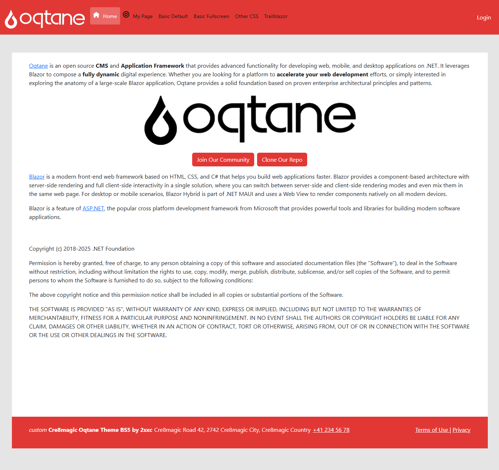
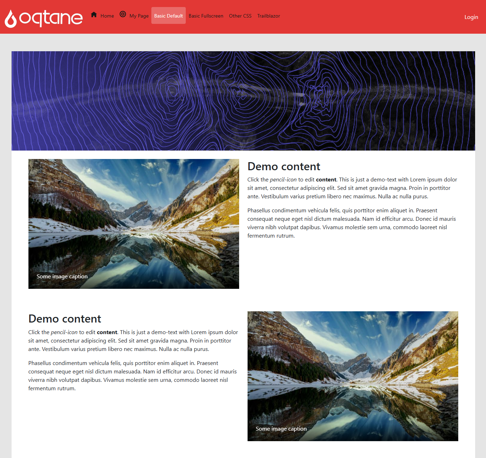
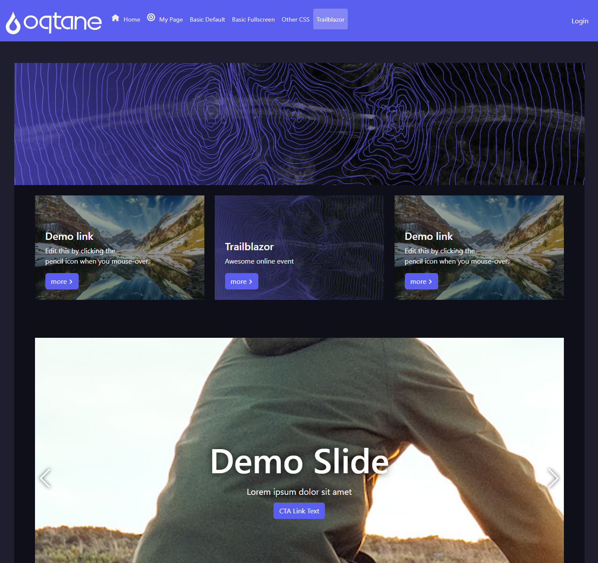
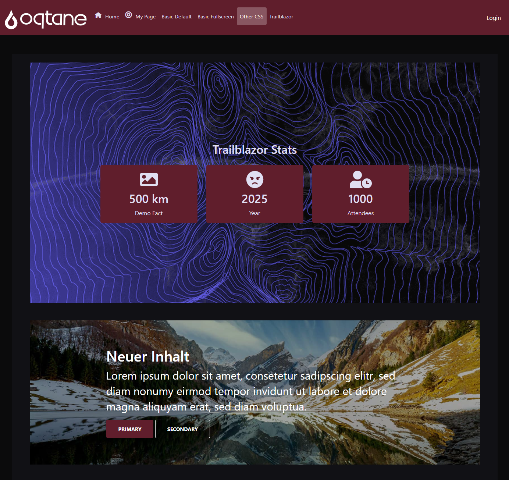
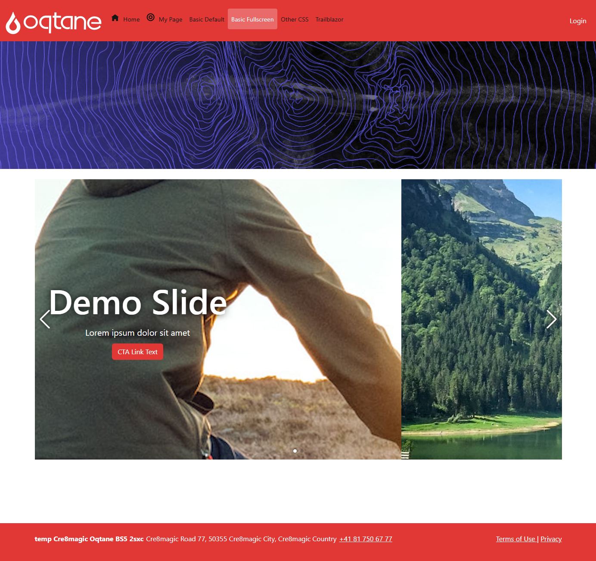

# Magic Theme: Oqtane Basic

This is the Oqtane Basic theme for Magic Themes.
It is an enhanced version of the default Oqtane theme, with some essential enhancements.

## First Impressions

  
  
  
  
  

---

## Features

### Standard Features already included in Oqtane Default Theme

- Fully responsive design (standard)
- Uses Bootstrap 5 (standard)

### General Enhancements

- Has 3 layouts: `Default`, `Centered`, and `Fullscreen` (enhanced)
- Optimized for 2 panes `Default` and `Header` (enhanced)
- Uses Bootstrap 5 CSS Variables to customize look and feel (enhanced)
- Option to customize css variables per site or page (enhanced)
- Container will not show line or title by default (enhanced)

### Code Quality Enhancements (compared to Oqtane Default Theme)

1. Code deduplication (like namespace for resources are in central location)
1. Data binding on `ThemeSettings` highly optimized to shorten code / more readable
1. Settings show the official fallback value so you can better see what happens if you don't set a value
1. Razor optimized so `@code` section comes first, which matches the order of execution
1. Project optimized to be `#nullable` for better code quality
1. Project optimized to use c# `preview` to leverage `field` and other new features

### Enhancements to Settings Handling

This theme has improved settings handling compared to default template.

1. Complete API to reduce the settings code in the Razor files
1. Special API to improve loading / editing / saving settings
1. Proper clean-up of settings in the DB when they are reset, so they don't block settings inheritance

## Installation

There are two ways to install the Oqtane Basic theme.

### Via NuGet Package

If you just install the theme directly, you can use it immediately.
It's great for a quick-start, but if you want to further customize it to your needs, you should use the template generator.

Just use the built-in marketplace in the theme manager to install the theme.

1. Walkthrough in the Oqtane documentation: [Install a Theme](https://docs.oqtane.org/manuals/system/theme-management.html#installing-themes)
1. Or you can manually download it from the Marketplace TODO:

### Via Template Generator

The template generator will create a new Visual Studio project with the Oqtane Basic theme.
It will generate code which then uses your company namespace and gives you source code to customize the theme.

1. First you must install the cre8magic Templates TODO: so Oqtane has all the source code
1. Then you can use the template generator to create a new project with the Oqtane Basic theme
1. Walkthrough in the Oqtane documentation: [Create a New Theme](https://docs.oqtane.org/manuals/system/theme-management.html#creating-themes)

## Customize the Logo

This is done using the standard Oqtane logo settings.

## Customize Look and Feel

To customize the theme, you can:

- use Bootstrap 5 CSS Variables
- specify custom footers per site or page
- if you generated the source code, you can customize anything you want

### Bootstrap 5 CSS Variables

Bootstrap 5 introduces a new way to customize the look and feel of your application using CSS variables.
You can override these variables in your own CSS to change the appearance of the theme.

Here are some examples of Bootstrap 5 CSS variables you can customize:

- `--bs-primary`: The primary color of the theme
- `--bs-secondary`: The secondary color of the theme
- `--bs-font-sans-serif`: The font family used for sans-serif text
- `--bs-font-monospace`: The font family used for monospace text

Best read the [Bootstrap 5 CSS Variables documentation](https://getbootstrap.com/docs/5.3/customize/css-variables/) to find all the available variables and their default values.

> [!TIP]
> This allows you to quickly change fonts, colors etc. without having to write custom CSS.
>
> What's especially cool is that you can use the power of Bootstrap 5 without having to run SASS parsers.

The Oqtane Basic theme offers multiple ways to set these variables:

1. By Site or Page in the Page Settings > Theme Settings
1. Just modify the `theme.css` file in the theme folder.
1. Completely custom if you generated the source code.

#### Customize via Page Settings

TODO: Screenshots etc.

#### Customize via `theme.css`

You can modify the `theme.css` file directly to change the Bootstrap 5 CSS variables.
By default, this is in `wwwroot/themes/ToSic.Cre8magic.Theme.Basic/theme.css`.
If you created a custom theme using the generator, the path will be different.

Important to know:

- This will serve as the default for all sites (incl. new sites).
- This is the easiest way, but you might lose your changes if you update the theme.

#### Customize via Source Code

If you generated the source code, you can customize the theme in any way you want.
So when you work on the source code, you could:

1. Just work on the `theme.css` file
2. Add custom CSS files
3. Add more variables
4. Completely rebuild all the CSS using VITE (pre-configured in the project)

## Customize Footer

The footer can be customized per site or per page.
If you just use the installed theme, you can do this in the Page Settings > Theme Settings.

You will need to paste HTML code into the footer field.
But to make your life easier, we've provided a template to start from.

If you generated the source code, you can customize the HTML directly in the Blazor source code.

## Customize Everything

If you want to customize everything, you must generate the source code using the template generator.
From there, you can customize the theme in any way you want.

---

## History

- Created: 2024-11-15
- Enhanced with UI for footer and CSS Variables: 2025-06-25
- Released 2025-06-26 for the [TrailBlazor 2025](https://trailblazor.net/) conference.
