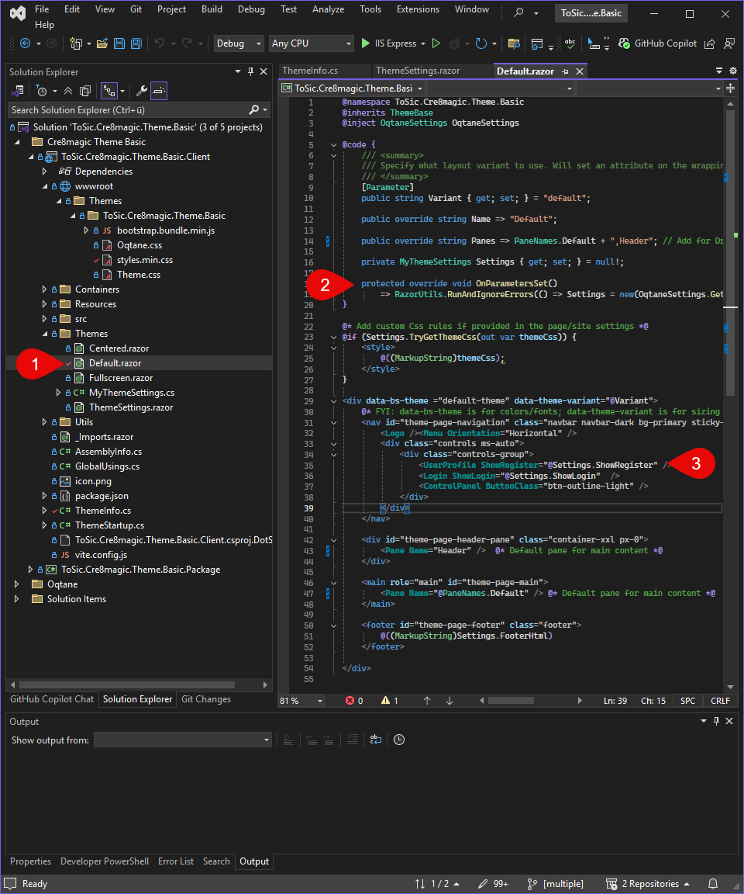

# Settings

[More about Theme Settings](xref:OqtaneThemes.ThemeSettings.Index)
  
## Add a new Theme Setting

To add a new setting to your theme, follow these steps. You’ll create a new input field in the settings UI, bind it to a key in your code, and make sure it saves and loads correctly from the database. Once that's done, you can use the setting in your HTML to control behavior like visibility or styles.

  
  
  

1. Open the file `ThemeSettings.razor`
2. In the HTML section, under the appropriate scope, insert your new input field.
3. Open `MyThemeSettings.cs` and create a new key for your setting (this defines the database field and allows data binding to the HTML).
4. Bind the new key to your input field in the HTML using `@bind`.
5. Build and run the project.
6. Navigate to the Theme Settings UI in your site.
7. Test your new input field: enter a value, save, and try clearing it or resetting to the default.
8. Check the database to confirm your new value is being saved correctly.
9. You're now ready to use this setting in your theme's HTML—for example, to show or hide content, adjust styles, or change layout behavior.

---

## Storage of Theme Settings

Changes to the Theme Settings are stored in the `Setting` table in the database.

> [!TIP]
> **Namespace – Avoiding Duplicates**  
> Each Theme Setting is assigned a unique namespace (e.g., `Theme.MyTheme.SettingName`) to prevent conflicts with other modules or themes.  
> These changes are saved and persist through deployments by being stored in the database.  
> This ensures that the settings can be uniquely identified and reliably assigned.

  

**UI Changes**

- Changes are made directly in the UI (e.g., color pickers, checkboxes).
- After making changes, you must click "Save" to apply them.

**Storage in the Database**

- Once saved, Theme Settings are stored in the Oqtane database.
- The database stores the settings either at the site level or page level, depending on the context.

---

## How and Where Are Theme Settings Loaded?

- When a page is loaded, the Theme Settings are first read from the database.
- The values are assigned to the correct theme based on their namespace.
- In the theme code, the settings can be loaded and used via the Settings API or through dependency injection.

  
  

