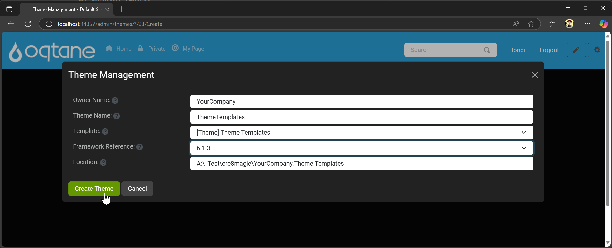
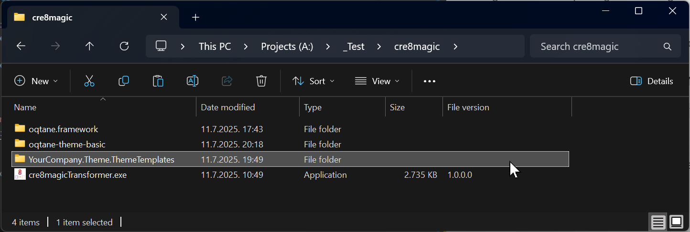
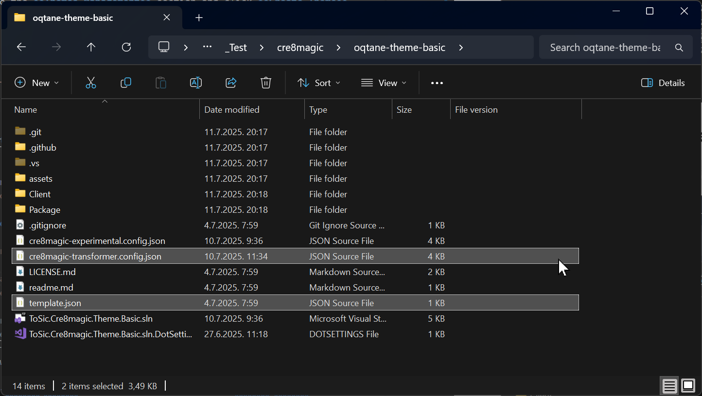
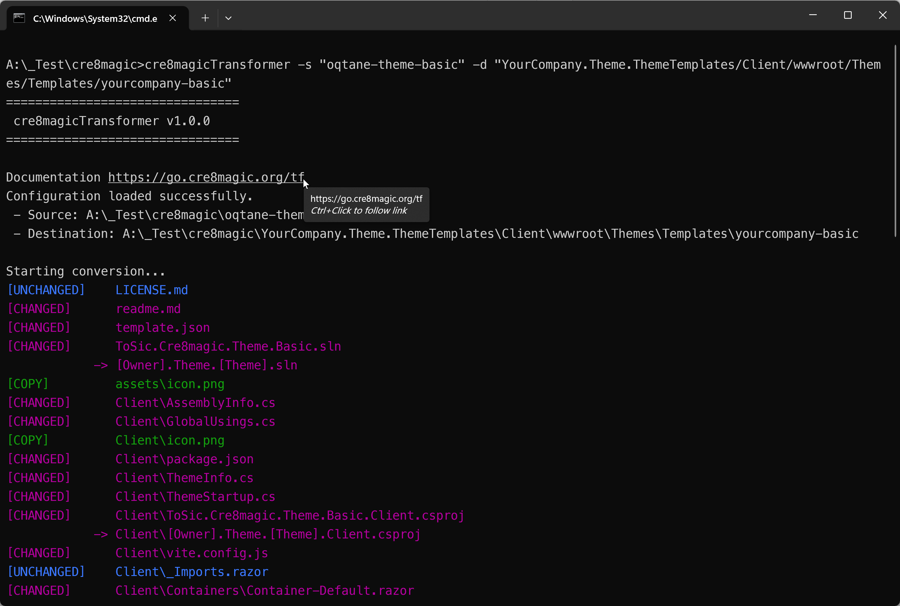
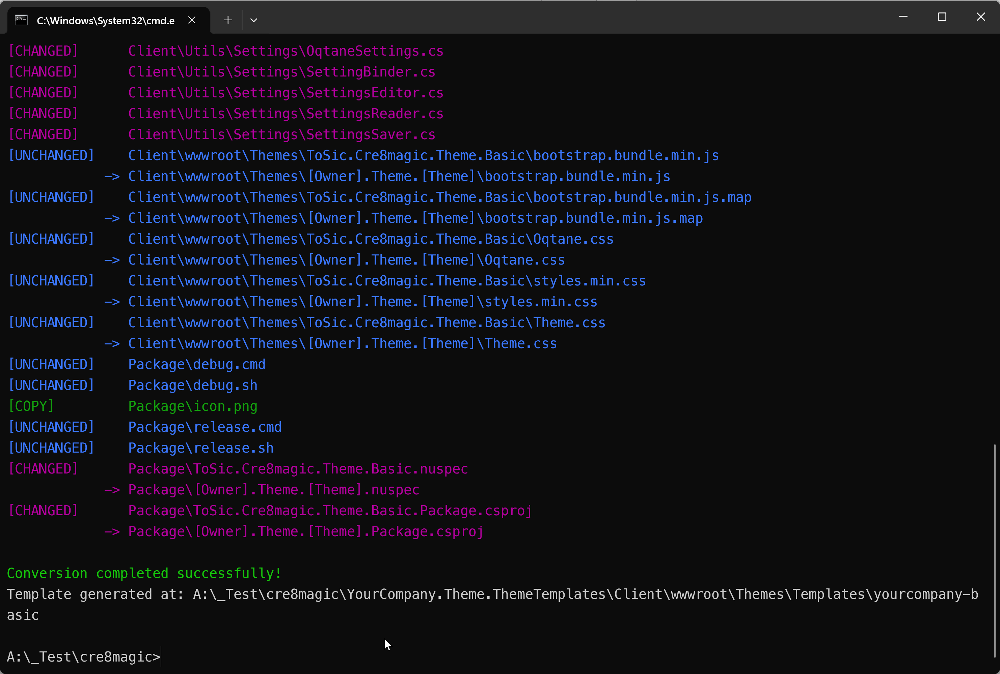
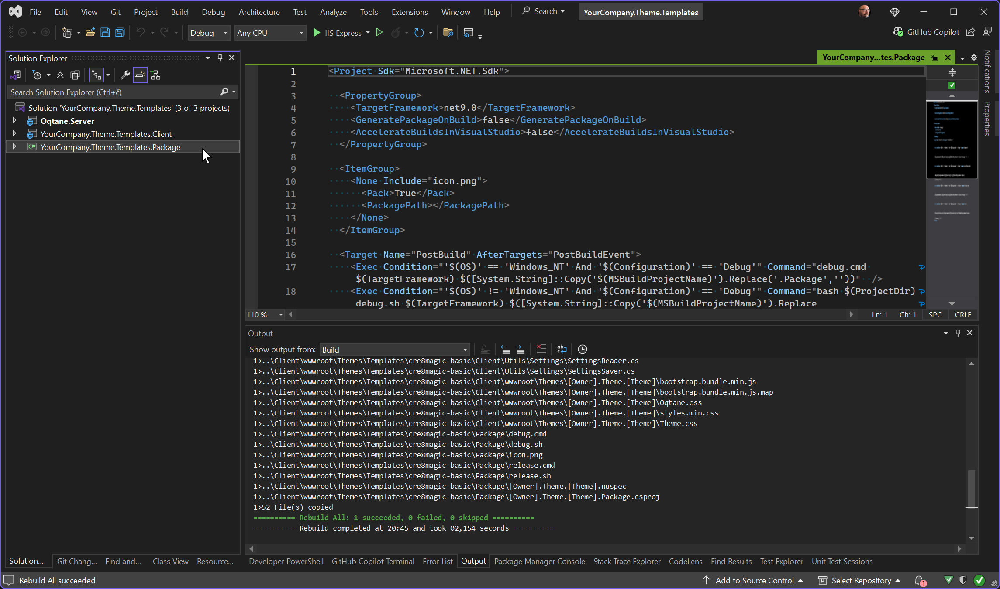
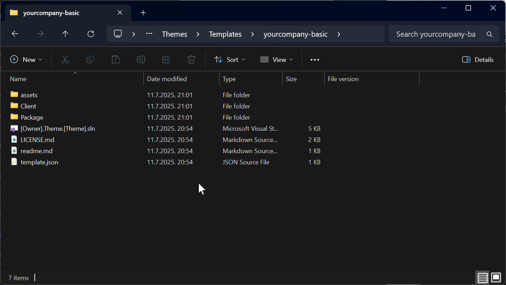
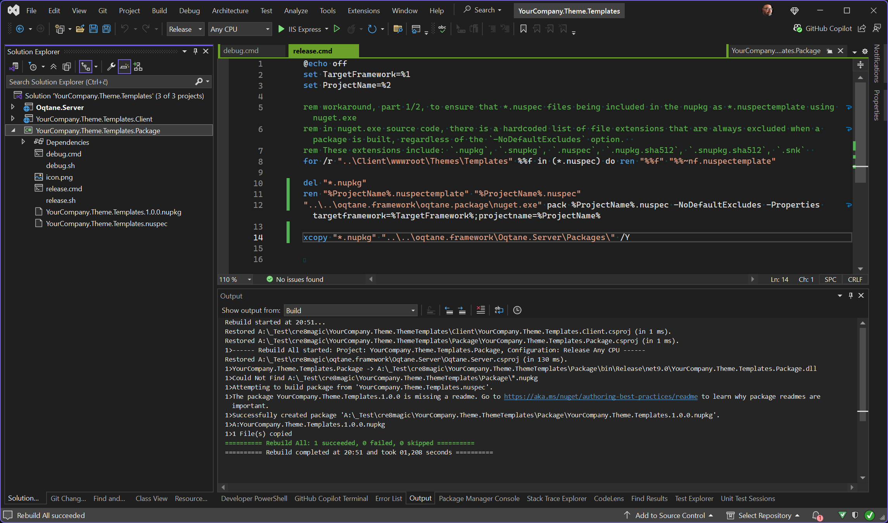
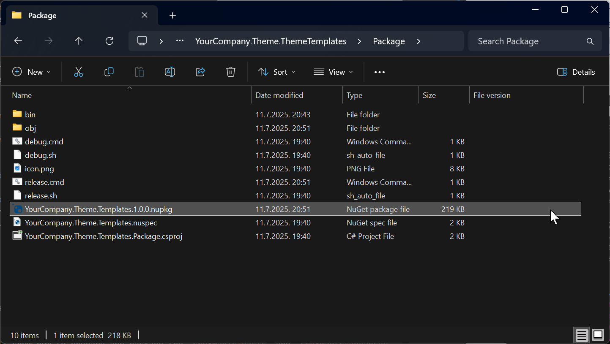

# cre8magic-template-packager

The `cre8magic-template-packager` is a specialized template designed to:

- Deploy all theme templates within a local Oqtane.Server installation.
- Create a package for distributing theme templates.

Developers can use this template to easily generate and share their own Oqtane theme templates, streamlining the process of templates development and distribution.

## How to Package a Single Theme Template

The goal is to create a package containing a single theme template, which can be used to deploy the template in Oqtane.Server or share it with others.

In this example, we will demonstrate how to prepare and package the `cre8magic-basic` theme template.

### Creating a Visual Studio Solution for the Theme Template

1. Ensure that `ToSic.Cre8magic.Theme.Templates.1.0.0.nupkg` is already installed in your local Oqtane development environment. If not, refer to [this guide](xref:Cre8magic.MagicThemes.ThemeTemplates.Index) for installation instructions.

1. **Access Theme Management**:  
   In the Oqtane Admin UI, navigate to the **Themes Management** section and click **Create Theme**.

1. **Fill in Details**:  
   Provide the following information:
   - `Owner Name`
   - `Theme Name`
   - Select the template: `[Theme] Theme Templates` from the list.
   - Choose the `Framework`.

   Then, click **Create Theme**.  
   

1. **Locate the Solution**:  
   A Visual Studio solution for your new theme is created near the `oqtane.framework` folder.  
   

### Converting Theme Source Code to a Theme Template

1. Ensure that `cre8magicTransformer.exe` is in the root folder. If not, download it from [here](https://github.com/cre8magic/cre8magic-transformer/releases).

1. Ensure that you have the `oqtane-theme-basic` folder with `cre8magic-basic` theme source code.  
   

1. Ensure that `cre8magic-transformer.config.json` and `template.json` files are present in the theme source code folder. Learn more about the [Configuration File](xref:Cre8magic.MagicTools.Transformer.Configuration) and [Template File](xref:Cre8magic.MagicTools.Transformer.Index).

1. Open a terminal and navigate to the folder containing the `cre8magic-transformer.exe` file.

1. Run the transformer with the following command:

   ```cmd
   cre8magicTransformer -s "oqtane-theme-basic" -d "YourCompany.Theme.ThemeTemplates/Client/wwwroot/Themes/Templates/yourcompany-basic"
   ```

   

   

### Deploying Theme Templates to Local Oqtane

1. Open the `YourCompany.Theme.ThemeTemplates/YourCompany.Theme.Templates.sln` solution in Visual Studio and switch to the `Debug` configuration.

1. Select the `YourCompany.Theme.Templates.Package` project and build it as usual.  
   

1. The `yourcompany-basic` folder containing your custom theme template will be deployed to `oqtane.framework\Oqtane.Server\wwwroot\Themes\Templates\`. You can now test it in Oqtane.  
   

### Packaging Theme Templates into a NuGet Package

1. Open the `YourCompany.Theme.ThemeTemplates/YourCompany.Theme.Templates.sln` solution in Visual Studio and switch to the `Release` configuration.

1. Select the `YourCompany.Theme.Templates.Package` project and build it as usual.  
   

1. A new package, `YourCompany.Theme.Templates.1.0.0.nupkg`, will be generated in the `YourCompany.Theme.ThemeTemplates/Package/` folder.  
   

## How to Package Multiple Theme Templates in the Same NuGet Package

To create a package containing multiple theme templates for deployment in Oqtane.Server or sharing:

- Ensure each theme template has a unique name.
- Follow the same steps as for a single theme template.

---

## History

- Released 2025-07-11.

Permanent link: <https://go.cre8magic.org/packager>