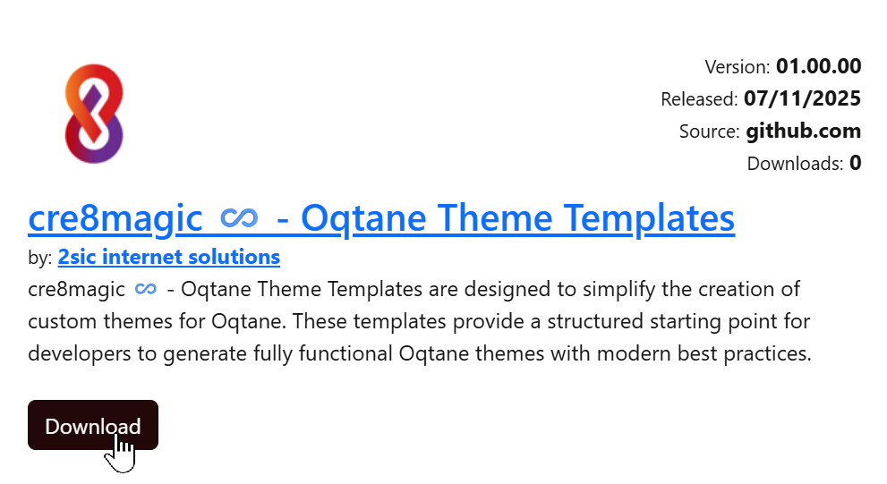
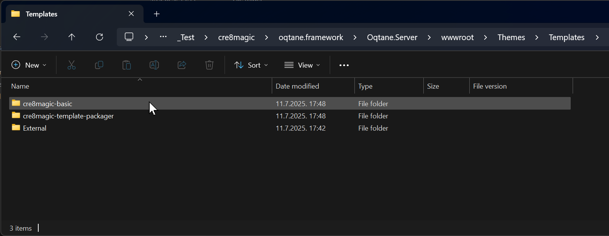
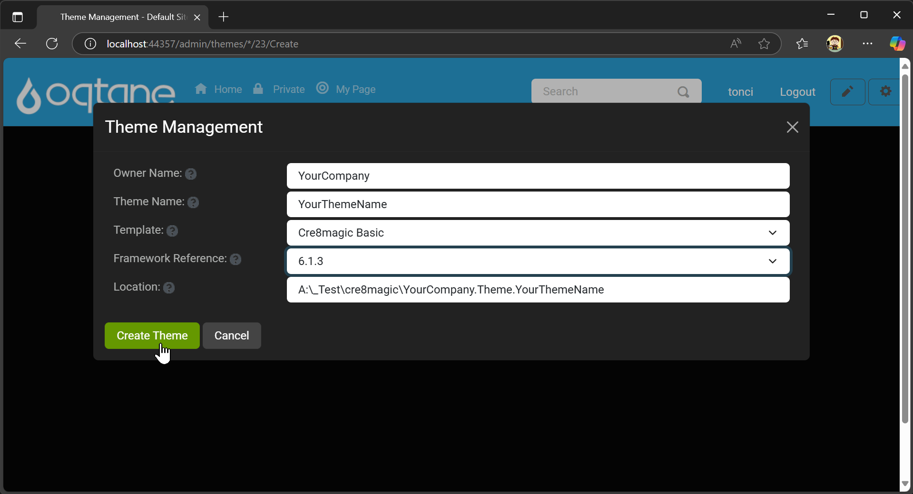
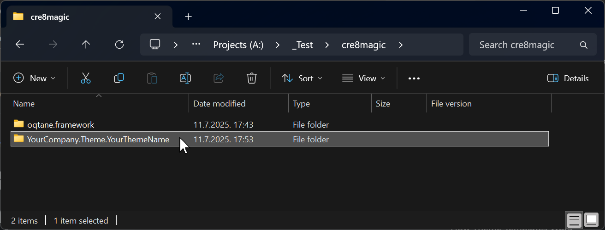
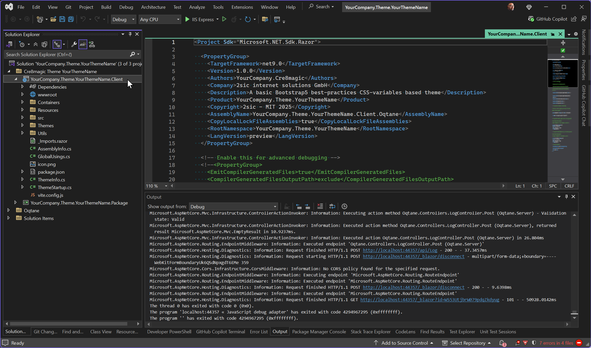

# cre8magic ♾️ - Oqtane Theme Templates

The `cre8magic ♾️ - Oqtane Theme Templates` simplify the creation of custom Oqtane themes by providing a structured starting point with modern best practices.

## Package Overview

The `ToSic.Cre8magic.Theme.Templates.1.0.0.nupkg` package includes the following templates:

- **`cre8magic-basic`**:  
  A theme template based on [cre8magic ♾️ - Oqtane Theme Basic](xref:Cre8magic.MagicThemes.OqtaneBasic.Index). It enhances the original Oqtane Basic Theme with Bootstrap 5 best practices, such as CSS variables, and other improvements.

- **`cre8magic-template-packager`**:  
  A [specialized template](xref:Cre8magic.MagicThemes.TemplatePackager.Index) for deploying all theme templates within a local Oqtane.Server installation or creating a package for distribution. Developers can use this to create and share their own Oqtane theme templates.

## Distribution Channels

The `cre8magic ♾️ - Oqtane Theme Templates` package is available through:

1. **[GitHub Releases](https://github.com/cre8magic/oqtane-theme-templates/releases)**: Download the latest version.
2. **[Oqtane Marketplace](https://oqtane.net)**: Access the package directly from the marketplace.  
   

## Installation Guide

Follow these steps to install the `cre8magic ♾️ - Oqtane Theme Templates`:

1. **Download the Package**:  
   Get the `ToSic.Cre8magic.Theme.Templates.1.0.0.nupkg` file from the [GitHub Releases](https://github.com/cre8magic/oqtane-theme-templates/releases/v01.00.00).

2. **Place the File**:  
   Copy the `.nupkg` file to the `Oqtane.Server/Packages` folder in your Oqtane installation.

3. **Restart Oqtane**:  
   Restart the Oqtane application to load the new templates.

4. **Verify Installation**:  
   The new templates will appear in the `Oqtane.Server/wwwroot/Themes/Templates` folder.  
   

## Creating a Custom Theme

1. **Access Theme Management**:  
   In the Oqtane Admin UI, navigate to the **Themes Management** section and click **Create Theme**.

2. **Fill in Details**:  
   Provide the following information:
   - `Owner Name`
   - `Theme Name`
   - Select the desired `template` from the list.
   - Choose the `Framework`.

   Then, click **Create Theme**.  
   

3. **Locate the Solution**:  
   A Visual Studio solution for your new theme will be created near the `oqtane.framework` folder.  
   

4. **Customize in Visual Studio**:  
   Open the solution in Visual Studio and start customizing it. Building and packaging work as usual.  
   

