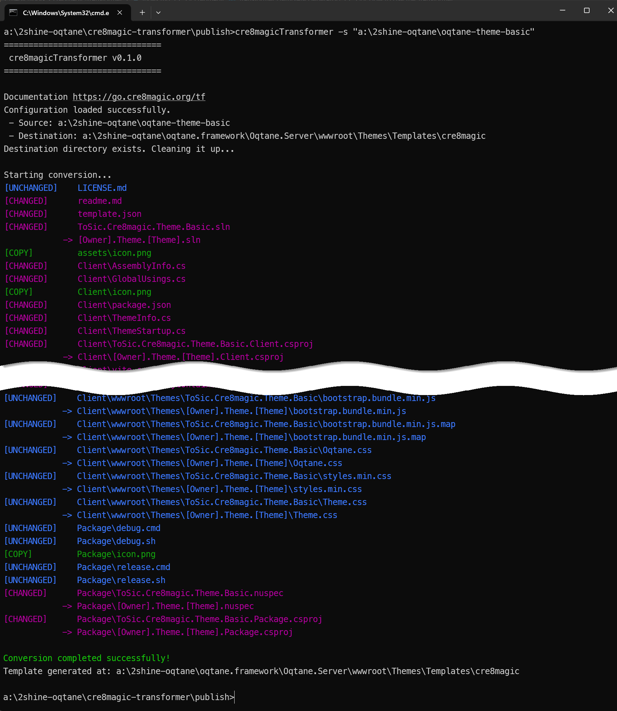

# cre8magic ♾️ Transformer (Template Generator)

The cre8magic Transformer will help you convert an existing themes into Oqtane templates.
And vice versa, it will also help you convert Oqtane templates into themes.
Templates can then be placed inside Oqtane so that users can develop their own themes based on your template.

## What is an Oqtane Template?

An Oqtane template is basically a set of source files containing a lot of placeholders.
For example, a `ThemeInfo.cs` might look like this:

```csharp
namespace [Owner].Theme.[Theme]; // <-- This cannot compile

public class ThemeInfo : ITheme
{
  public Oqtane.Models.Theme Theme => new()
  {
      Name = "[Owner] [Theme]",
      Version = "1.0.0",
      PackageName = "[Owner].Theme.[Theme]",
      Resources =
      [
          new Stylesheet("~/Theme.css"),
          new Script("~/bootstrap.bundle.min.js"),
      ]
  };
}
```

This is difficult to develop, since it cannot be tested with the placeholders.

> [!TIP]
> What we need is a way to work on a Theme without having to deal with the placeholders.
> Then we need a magic converter to take the latest version of the theme and convert it into a template.
>
> The **cre8magic ♾️ Transformer** will help you convert your existing themes into templates.
> You can use it again and again, as your theme evolves.

The **cre8magic ♾️ Transformer** takes a) an existing theme and b) a [configuration file](xref:Cre8magic.MagicTools.Transformer.Configuration),
and generates all the files you need to create a theme template.

The converter is being used extensively by the **cre8magic ♾️** team to create new themes.

We expect to release the first version of the converter in 2025-Q3.

## What the cre8magic ♾️ Transformer Does

The transformer will run 3 distinct tasks:

1. Select files based on specific patterns in the configuration file.
   - For example, it will select all assets in the `wwwroot` folder and all `.cs` files in the `Client` folder.
2. Rename files and folders based on the configuration file.
   - For example, it will rename `ToSic.Cre8magic.Theme.Basic.sln` to `[Owner].Theme.[Theme].sln`.
3. Replace placeholders in the selected files with the actual values from the configuration file.
   - For example, it would replace `namespace ToSic.Cre8magic.Theme.Basic;` with `namespace [Owner].Theme.[Theme];` in the `ThemeInfo.cs` file.


## How to Use the cre8magic ♾️ Transformer

1. Create a theme any way you want, test it, develop it, etc.
1. Add a [`template.json` file](xref:OqtaneThemes.Templates.Index) - this will be used by Oqtane to describe the Template to the user.
1. Add a `cre8magic-transformer.config.json` [configuration](xref:Cre8magic.MagicTools.Transformer.Configuration) file to the theme folder.
1. Run the converter, which will generate a new folder with the template files.
    1. During testing, you will deploy it to your Oqtane `Oqtane.Server/wwwroot/Themes/Templates` folder.
    1. To release it as a nuget package, you will ...
1. Use the generated files to create an installable NuGet package.
1. Deploy directly or through the Oqtane Marketplace.

## How to Install the Transformer

The transformer is a command line tool that you can run from the terminal or command prompt.

Download the latest version from the [releases page](https://github.com/cre8magic/cre8magic-transformer/releases)
and place it anywhere you want - it's a standalone executable.

## How to Use the Transformer

The **cre8magic ♾️ Transformer** CLI tool (`cre8magicTransformer.exe`) simplifies the process of converting themes into templates.

### CLI Arguments

- `-s`, `--source <path>`: Path to the source directory containing the Oqtane theme (required).
- `-d`, `--destination <path>`: Path to the output directory for the generated template. Defaults to the location specified in `cre8magic-transformer.config.json`.
- `-c`, `--config <path>`: Path to the JSON configuration file. Defaults to `cre8magic-transformer.config.json` in the source directory.
- `-h`, `--help`: Displays usage information.

### Example Workflow

1. Ensure the theme source folder contains a valid `cre8magic-transformer.config.json` file.
1. Open a terminal and navigate to the directory containing `cre8magicTransformer.exe`.
1. Run the tool with the required `--source` argument:

   ```cmd
   cre8magicTransformer -s "a:\2shine-oqtane\oqtane-theme-basic"
   ```

1. The tool processes the theme, renames files, replaces tokens, and generates the template in the specified destination directory.

   

1. Upon successful conversion, a message `Conversion completed successfully!` is displayed.
1. Since destination path is on expected place in local oqtane installation for theme template (e.g., `a:\2shine-oqtane\oqtane.framework\Oqtane.Server\wwwroot\Themes\Templates\cre8magic`) start the oqtane and use the generated template to create new theme source code solution.

➡️ For configuration details, see [Configuration File](xref:Cre8magic.MagicTools.Transformer.Configuration).

---

Permanent link: <https://go.cre8magic.org/tf>
