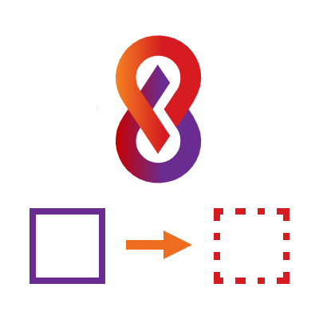

# cre8magic ♾️ Template Generator

The cre8magic Template Generator will help you convert an existing themes into Oqtane templates.
These can then be placed inside Oqtane so that users can develop their own themes based on your template.

## What is an Oqtane Template?

An Oqtane template is basically a set of source files containing a lot of placeholders.
For example, a `ThemeInfo.cs` might look like this:

```csharp
using Oqtane.Models;
using Oqtane.Themes;

namespace [Owner].Theme.[Theme]; // <-- This cannot compile

public class ThemeInfo : ITheme
{
  public Oqtane.Models.Theme Theme => new()
  {
      Name = "[Owner] [Theme]",
      Version = "1.0.0",
      PackageName = "[Owner].Theme.[Theme]",
      Resources =
      [
          new Stylesheet("~/Theme.css"),
          new Script("~/bootstrap.bundle.min.js"),
      ]
  };
}
```

This is difficult to develop, since it cannot be tested with the placeholders.

> [!TIP]
> The **cre8magic ♾️ Template Generator** will help you convert your existing themes into templates.

So what it does is it takes a) an existing theme and b) a `.json` configuration file,
and generates all the files you need to create a theme template.

The converter is being used extensively by the **cre8magic ♾️** team to create new themes.

We expect to release the first version of the converter in 2025-Q3.

## What the Template Generator Does

The template generator will run 3 distinct tasks:

1. Select files based on specific patterns in the configuration file.
   - For example, it will select all assets in the `wwwroot` folder and all `.cs` files in the `Client` folder.
2. Rename files and folders based on the configuration file.
   - For example, it will rename `ToSic.Cre8magic.Theme.Basic.sln` to `[Owner].Theme.[Theme].sln`.
3. Replace placeholders in the selected files with the actual values from the configuration file.
   - For example, it would replace `namespace ToSic.Cre8magic.Theme.Basic;` with `namespace [Owner].Theme.[Theme];` in the `ThemeInfo.cs` file.


## How to Use the Generator

1. Create a theme any way you want, test it, develop it, etc.
1. Add a special  `...config.json` file to the theme folder.
1. Run the converter, which will generate a new folder with the template files.
    1. During testing, you will deploy it to ... ???
    1. To release it as a nuget package, you will ...
1. Use the generated files to create an installable NuGet package.
1. Deploy directly or through the Oqtane Marketplace.

## How to Install the Generator

The generator is a command line tool that you can run from the terminal or command prompt.

Download the latest version from the [releases page](https://github.com/cre8magic/oqtane-template-generator/releases)
and place it anywhere you want - it's a standalone executable.

## How to Use the Generator TODO: @stv

...

...

➡️ See the [Configuration File](xref:Cre8magic.MagicTools.TemplateGenerator.Configuration) for details on how to configure the generator.
