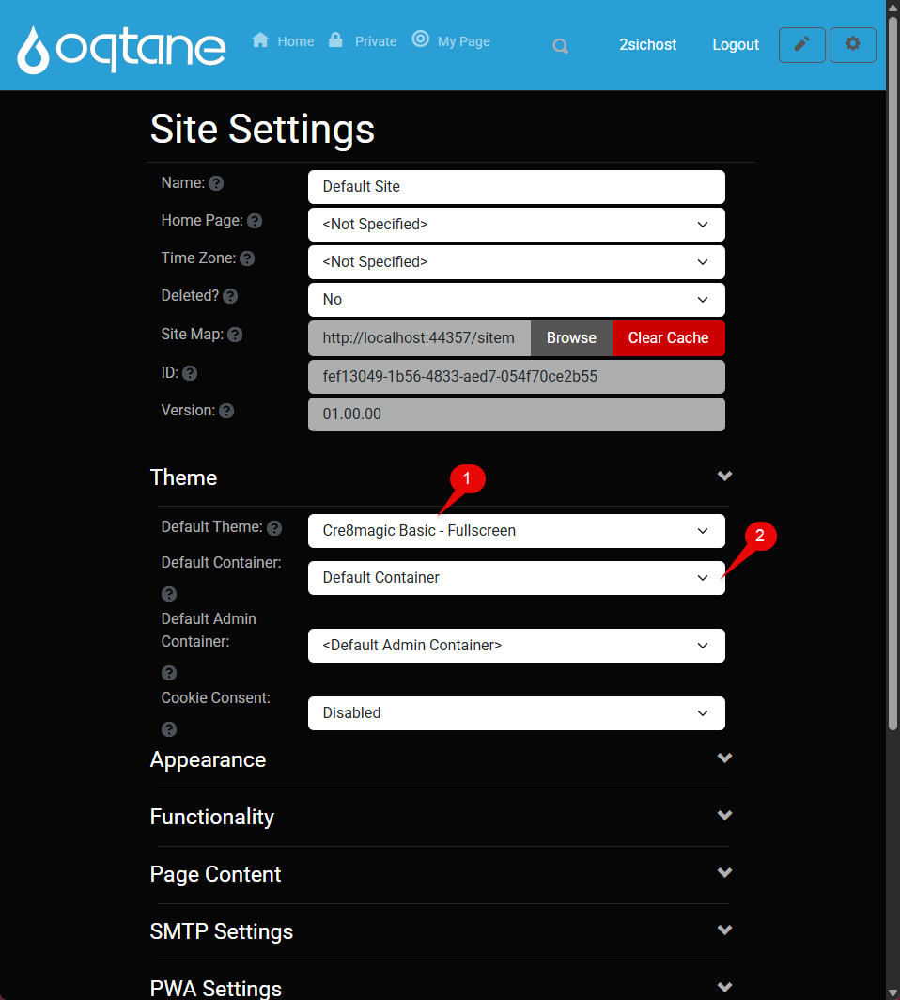
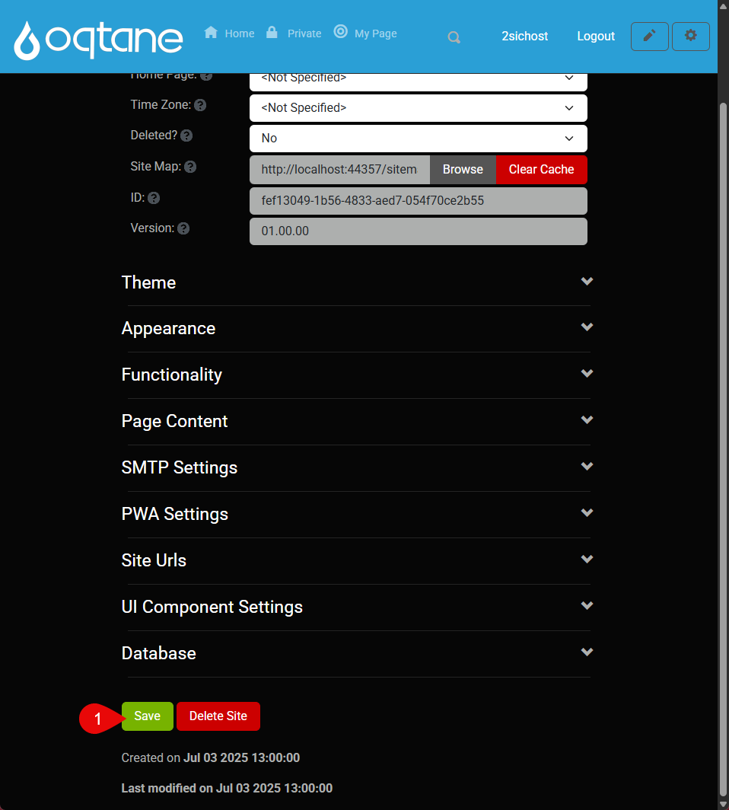
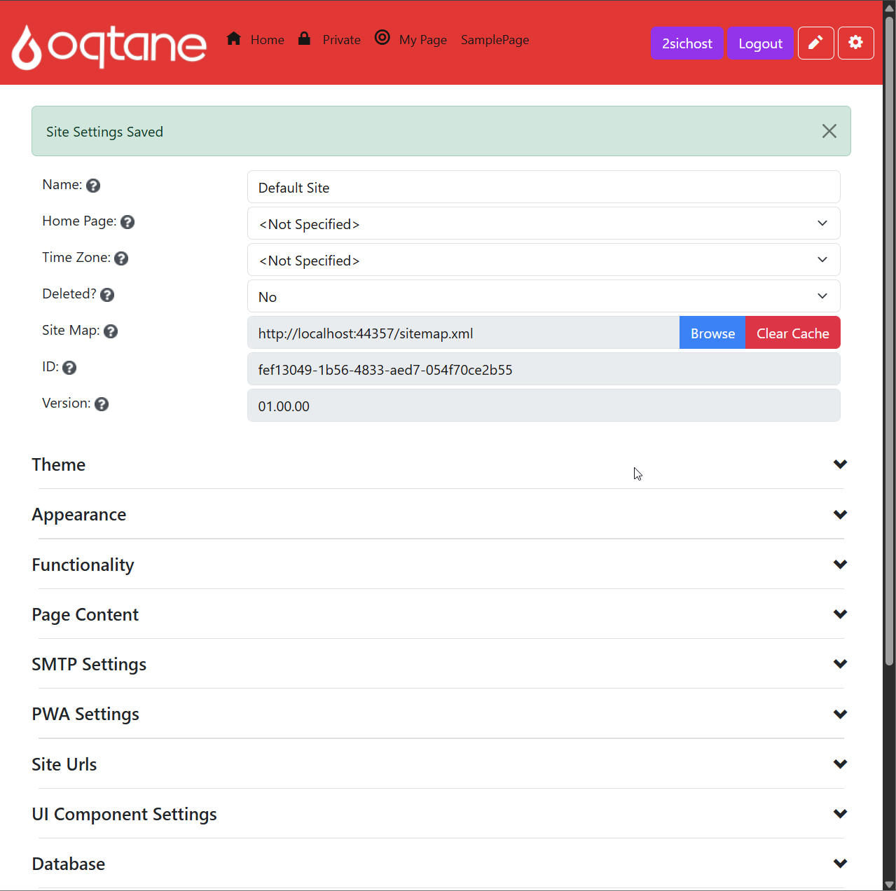
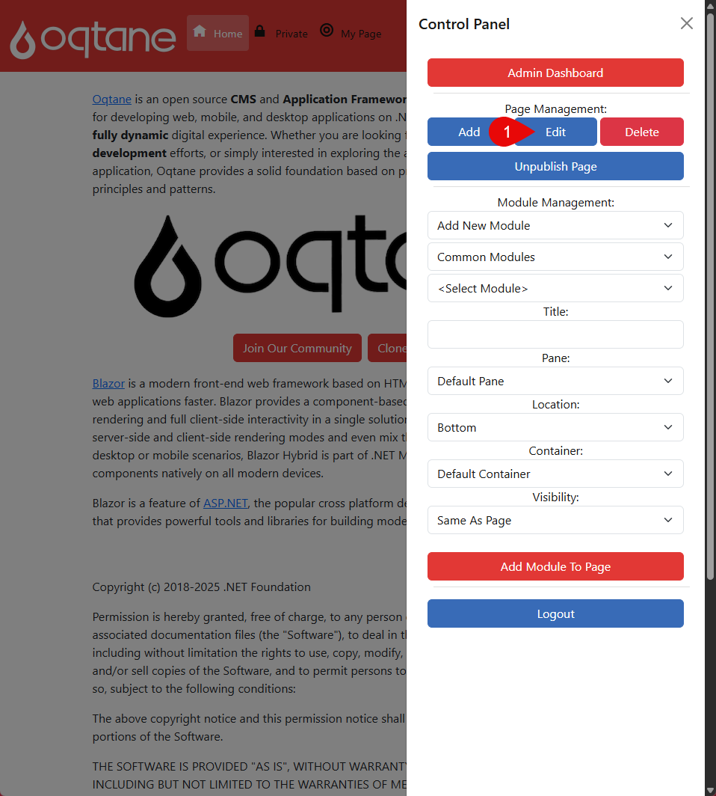
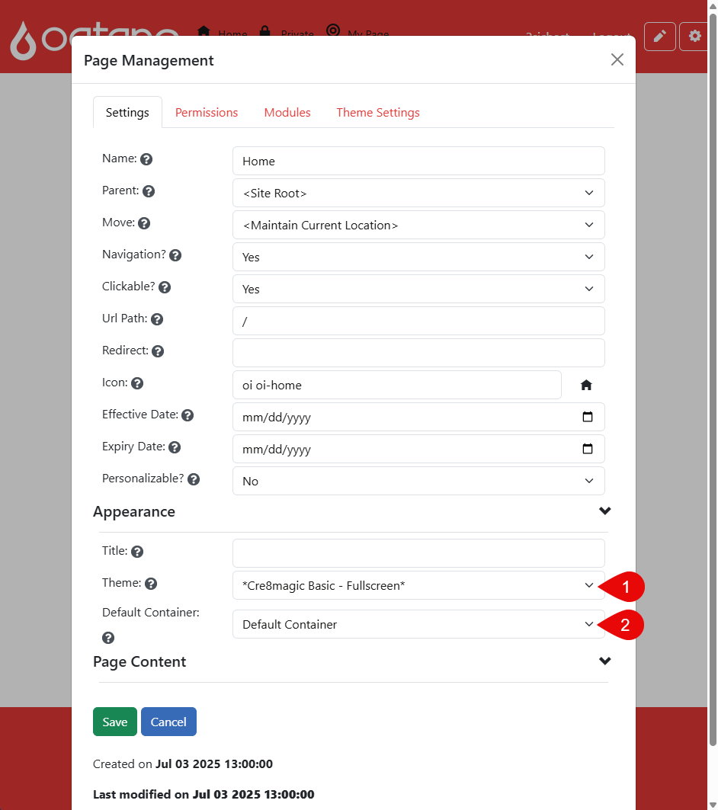

# Assign to Site or Page

This guide explains how to configure your installed theme in Oqtane – both globally for the entire site and individually per page  
You’ll learn how to assign a theme and set defaults.

## Assign the Theme and set the Container Default

Apply the theme to all pages. Also, add the default container.

  
  
  

Once your theme is installed

To set it as default:

1. Open **Site Settings**
2. Choose your **Default Theme** and **Default Container**
3. Click **Save Site Settings**

That’s it — your theme is now active across the site!

> [!WARNING]
> If a theme has already been defined on a page, the global settings will not apply to that page.

---

## Set Theme on a Page

To apply a theme to a specific page:

  
  

1. Open the **Page Settings**

In **Page Management**, you can configure layout options for the current page:

- Change the **Theme** (e.g., Fullscreen or Centered)  
- Change the **Container** (e.g., Default or Header)

---
