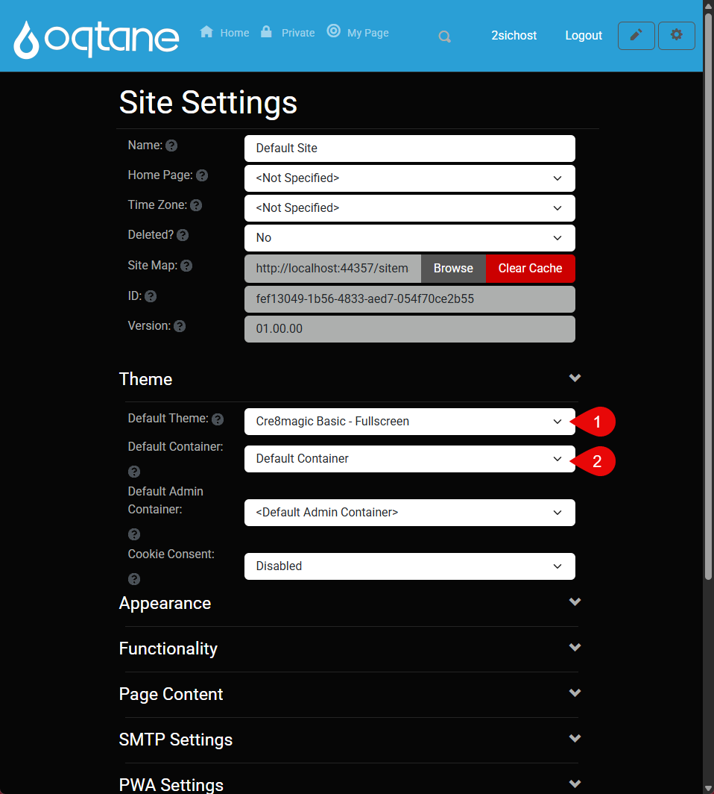

# Assing Theme Guide

This guide explains how to configure your installed theme in Oqtane – both globally for the entire site and individually per page  
You’ll learn how to assign a theme and set defaults.

## Assing the Theme and Default

  
  
  
  

Once your theme is installed:

1. Go to **Theme Management** – your theme should be listed  
2. Click **Assign** to apply it to all pages

To set it as default:

1. Open **Site Settings**
2. Choose your **Default Theme** and **Default Container**
3. Click **Save Site Settings**

That’s it — your theme is now active across the site!