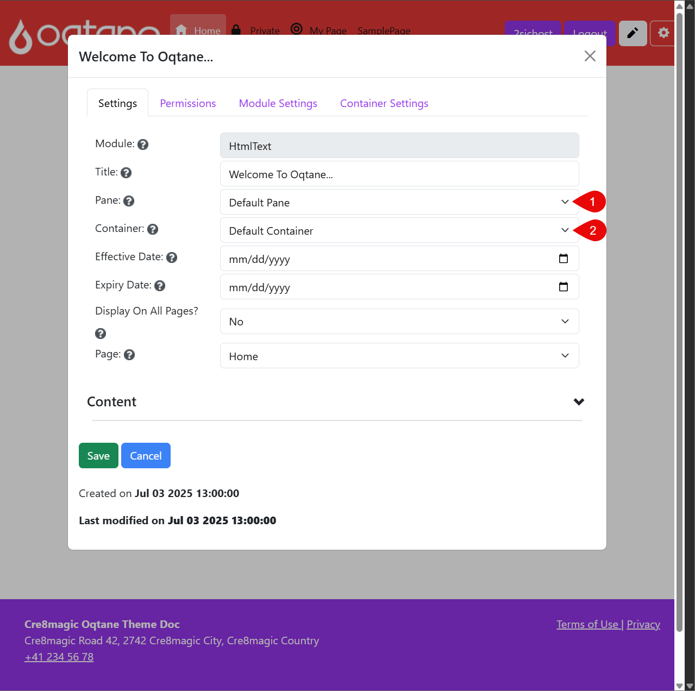

# Configuration Theme Guide

This guide explains how to configure your installed theme in Oqtane – both globally for the entire site and individually per page  
You’ll learn how to change Theme on a Page, Theme Settings and fine-tune pane and container placement for better layout control.

## Change Themes Settings

  
  

In **Theme Settings**, you can customize options for the current page or the entire site.

1. Select the **Scope** – choose **Site** to apply changes globally.  
2. You can also modify custom settings specific to the theme here.  
3. For example, in the Cre8magic Basic theme, you can optionally update the **Footer HTML** and **Bootstrap 5 Theme CSS**.

Click **Save** to apply your changes.

If you updated the **Site Settings**, the **Site Default** will be shown as a preview on other pages.

---

## Page Configuration: Pane & Container

  
  
  
  
  

This section explains how to change the **Pane** or **Container** for a module on a page.

### What is a *Pane*?

A *Pane* is a defined area or placeholder in a page layout where modules are placed. Common panes include `DefaultPane`, `HeaderPane`, and others.

### What is a *Container*?

A *Container* is the visual wrapper around a module that controls its appearance — including spacing, borders, headers, and styling. Different containers provide different UI looks.

Here’s how to configure these settings:

1. Go to the page containing your module and click the **Edit icon** (pencil) to open the page settings.

You’ll see the module currently placed in the default pane.  
> If you’re not using the Cre8Magic Theme, you may see additional panes depending on your layout.

To move the module:

1. Click the **down arrow** next to the module, then select **Manage Settings**.

In the module settings dialog:

1. Change the **Pane** (e.g., move it to `HeaderPane`).  
2. Change the **Container** (e.g., select the `Header Container` for different padding and style).

After saving:

1. The module will appear in the new pane (`HeaderPane`).  
2. The container style will update the module’s visual appearance accordingly.