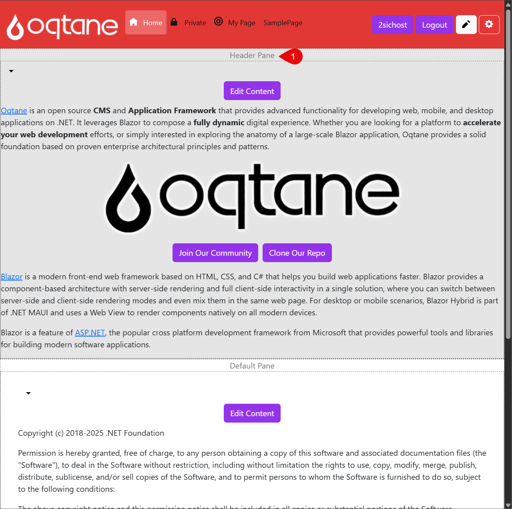

# Move Module to other Pane

This section explains how to move a module to a different Pane on a page.

  
  
  
  

Follow these steps to move a module to a different pane:

1. Navigate to the page containing the module and click the Edit icon (pencil) to enter edit mode.

You’ll see that the module is currently placed in the default pane.  
> If you're not using the Cre8Magic Theme, your layout may include additional panes.

To change the pane:

1. Click the **dropdown arrow** next to the module and choose **Manage Settings**.

In the module settings dialog:

1. In the module settings dialog, select a different Pane (e.g., `HeaderPane`).  

After saving:

1. The module will now appear in the selected pane (e.g., `HeaderPane`)