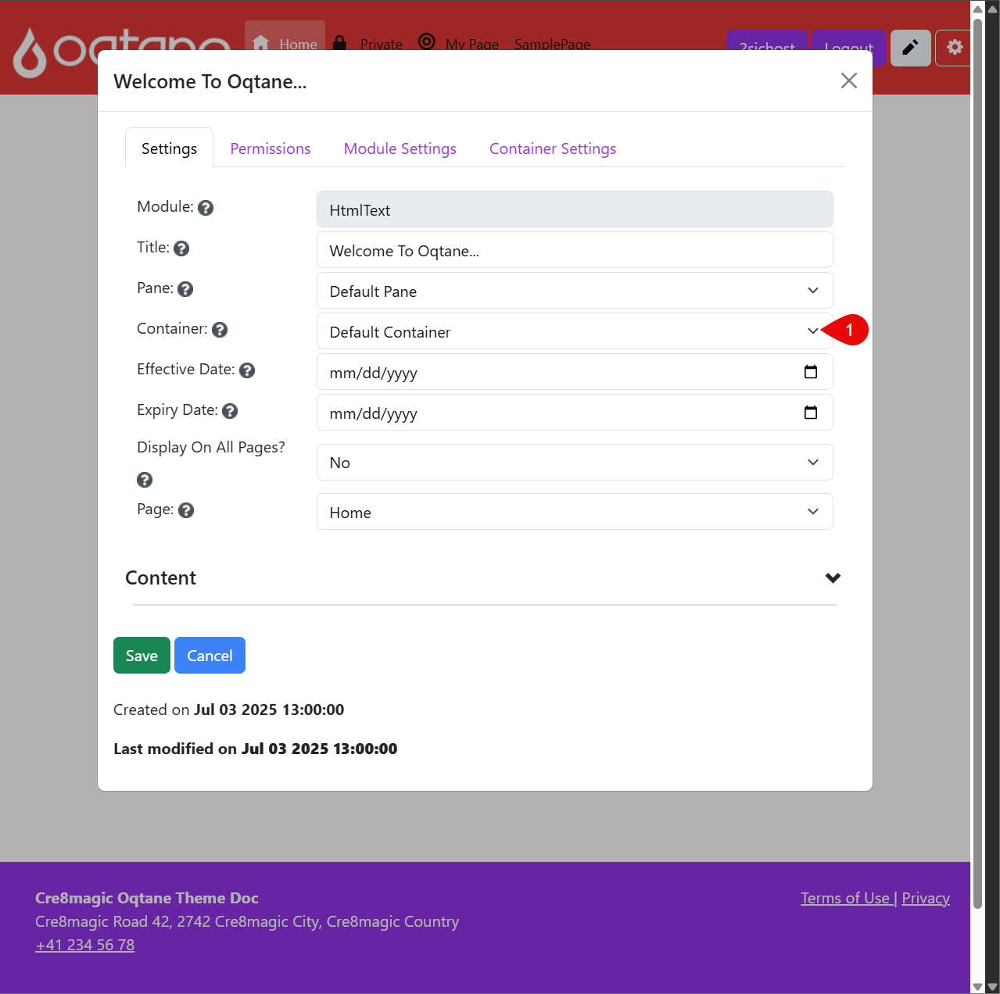
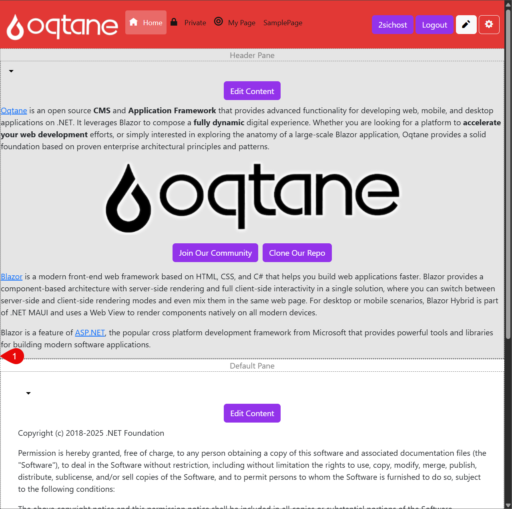

# What is a Container

A **Container** is the visual wrapper around a module that controls how it looks on the page.
It defines the module's appearance — including spacing, borders, background, titles, and other styling elements.

While the [Pane](xref:OqtaneThemes.WhatArePanes.Index) determines where a module appears, the **Container** defines how it appears.

## Examples of Container Use

Different containers can be used to give modules a unique visual style. For instance:

- A simple container with just a title and padding
- A framed container with a border and background color
- A minimal container with no visible decoration

The available containers depend on the theme you're using.
Some themes (like Cre8Magic) may only include one container, while others offer multiple style options.

---

## How to Change the Container

This section shows how to change the ***Container** for a module on a page.

  
  
  
  

Steps to Change the Container

1. Go to the page containing your module and click the **Edit icon** (pencil) to enter edit mode.

2. Click the **dropdown arrow** next to the module, then select **Manage Settings**.
3. In the module settings dialog, choose a different **Container** from the dropdown list.
This will affect how the module is displayed visually.
4. Click save and close the Dialog to see the Changes
