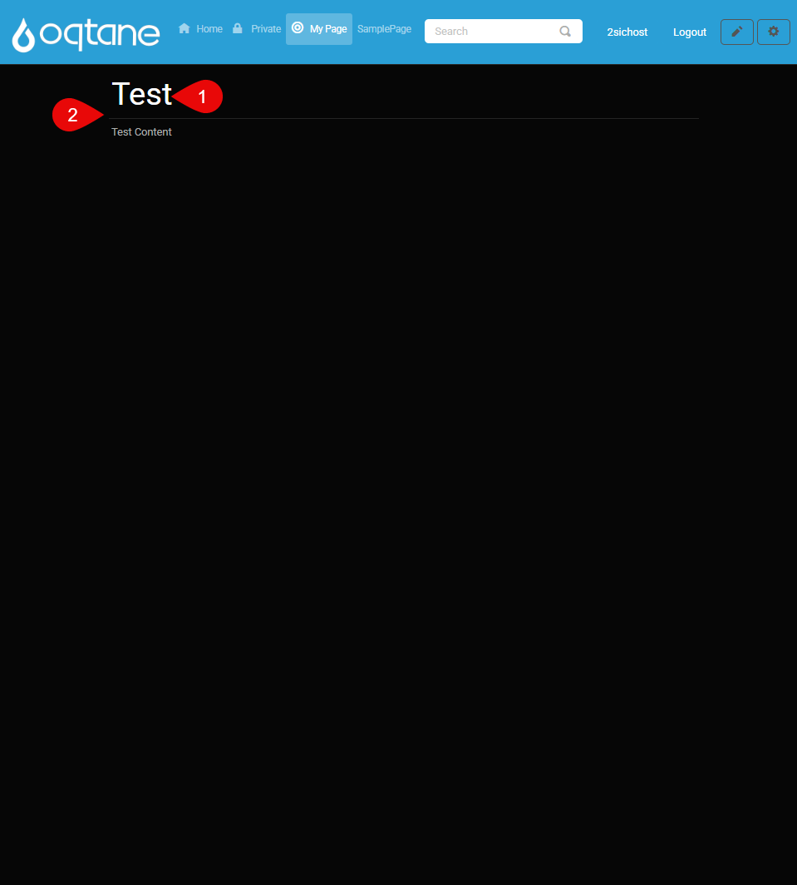
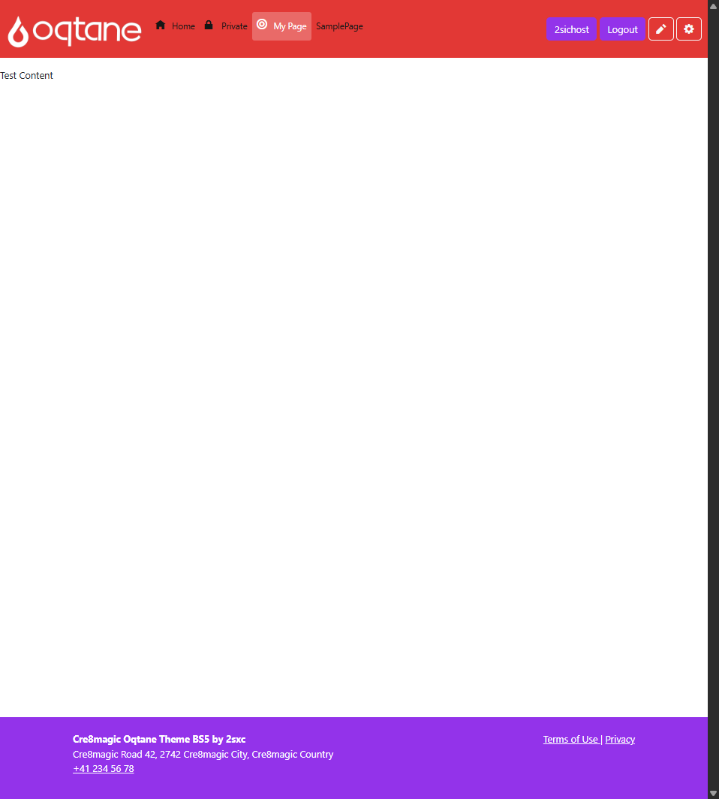
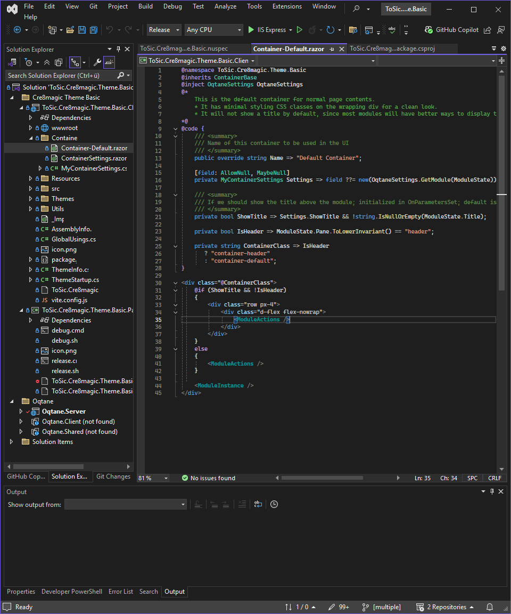
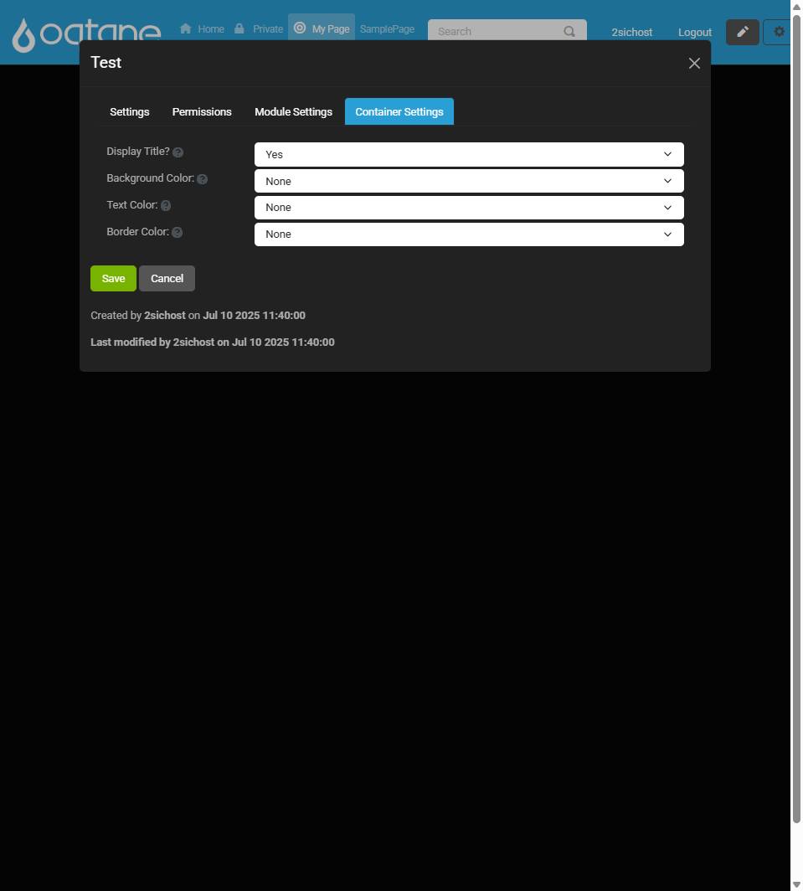

# What is a Container

A **Container** is the visual wrapper around a module that controls how it looks on the page.
It defines the module's appearance — including spacing, borders, background, titles, and other styling elements.

While the [Pane](xref:OqtaneThemes.WhatArePanes.Index) determines where a module appears, the **Container** defines how it appears.

<div gallery="gallery01">
  
  

</div>

## Examples of Container Use

Different containers can be used to give modules a unique visual style. For instance:

- A simple container with just a title and padding
- A framed container with a border and background color
- A minimal container with no visible decoration

The available containers depend on the theme you're using.
Some themes (like Cre8Magic) may only include one container, while others offer multiple style options.

<div gallery="gallery02">
  
</div>

> [!TIP]
> Containers should not include a title directly.  
> Containers can have settings (e.g., "Show Title" as default).

<div gallery="gallery03">
  
</div>

> [!TIP]
> Create only one container – this simplifies usage.
> Within the container, you can apply different CSS classes based on the pane (e.g., if it's the `HeaderPane`, add a `header-specific CSS` class)


> [!WARNING]
> The container must be in the same namespace as the theme.
>
> ```xml
> @namespace ToSic.Cre8magic.Theme.Basic
> ```
