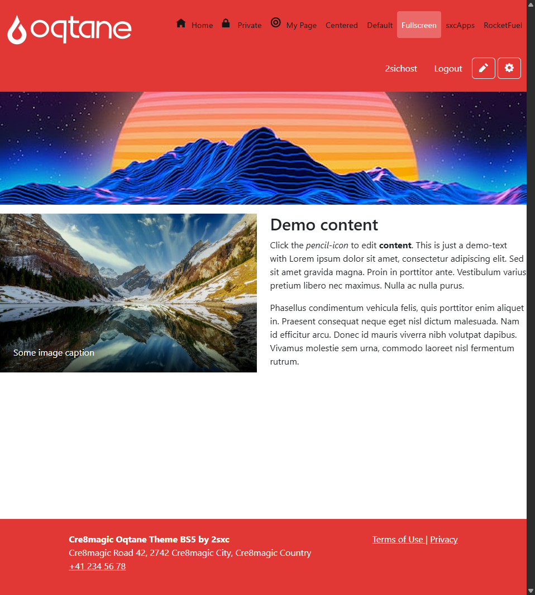
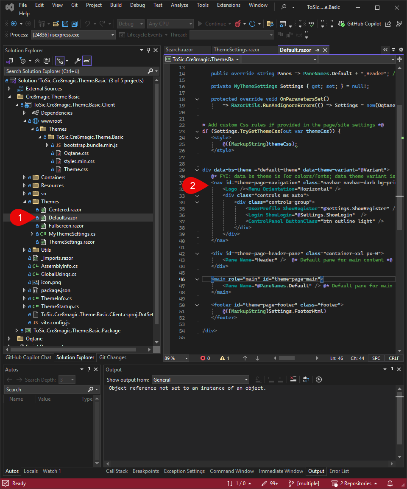
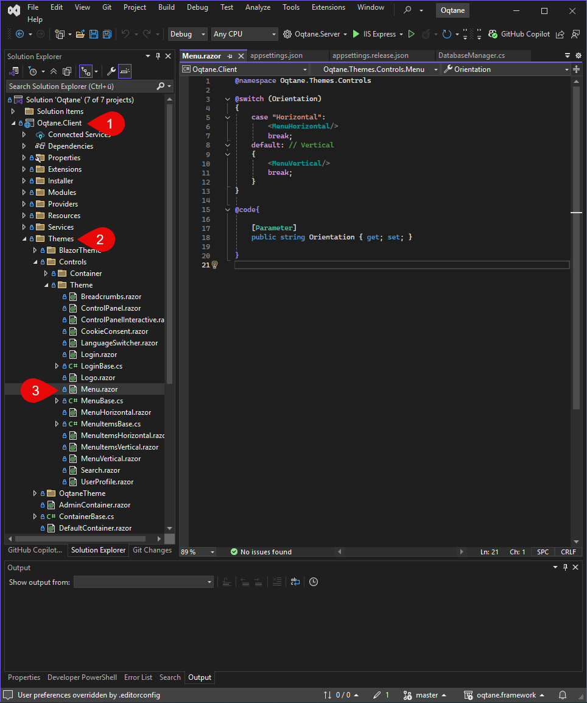

# What is Navigation

**Navigation** refers to the main bar at the top area (header) of an Oqtane page. It allows users to navigate between different subpages.

The navigation typically includes links to the **homepage and various defined pages**, **login/logout**,
and – if a user is logged in – buttons like **"Edit Page"** or **"Admin Dashboard"**.

---

## What can the navigation look like

For that, I'll show you the default and a custom one so you understand what I mean by navigation and how to customize it.

### Default Example in the Cre8magic Theme

The theme shows how a simple and functional navigation can look, e.g., as a horizontal bar with links.

  

### Custom

The navigation can be customized in many ways. For example:

- Placing the logo differently
- Adding a search bar in the header
- Making it mobile-friendly (responsive), e.g., with a burger menu

  

---

## Where is the navigation defined in the code

The navigation is defined in the theme, typically in the following file:

  
  

> [!TIP]
> [More about Menu](xref:OqtaneThemes.MenuAndBreadcrumbs.Index)

