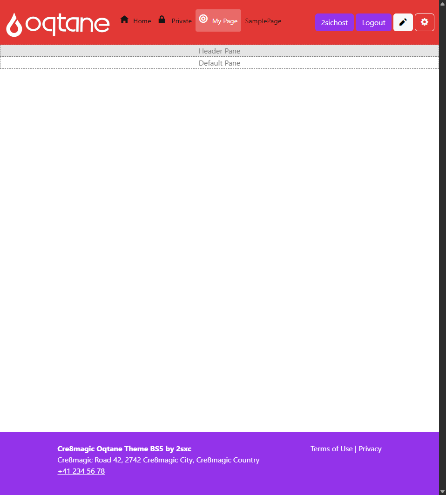
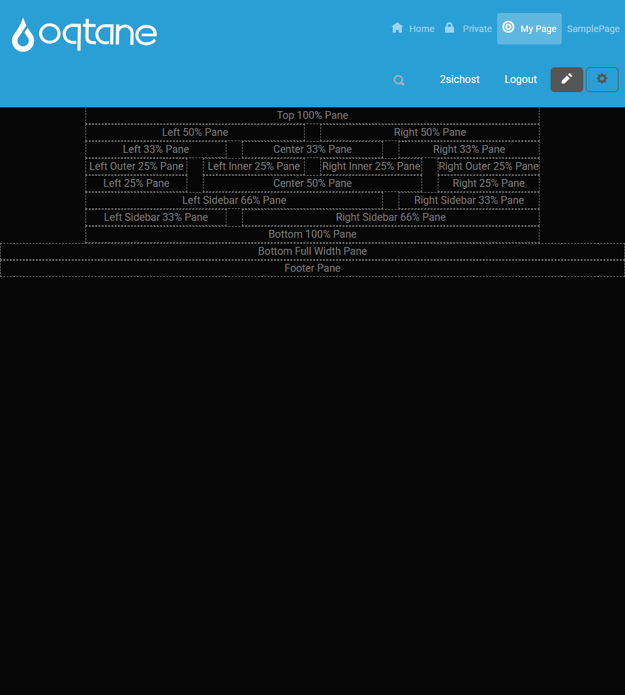

# What is a Pane

A ***Pane** is a designated area or placeholder within a page layout where modules can be placed.
Common examples include DefaultPane, HeaderPane, and others.

Each theme or layout can define its own set of panes. The names and number of panes depend on how the layout was built by the designer.

<div gallery="gallery01">
  
  
</div>

> [!TIP]
> Only create the panes that are necessary for your layout.

Themes > `Default.razor`

 ```xml
public override string Panes => PaneNames.Default + ",Header"; // Add for Dropdown Menu

<div data-bs-theme ="default-theme" data-theme-variant="@Variant">
    @* FYI: data-bs-theme is for colors/fonts; data-theme-variant is for sizing etc. *@
    <nav id="theme-page-navigation" class="navbar navbar-dark bg-primary sticky-top">
        <Logo /><Menu Orientation="Horizontal" />
        <div class="controls ms-auto">
            <div class="controls-group">
                <UserProfile ShowRegister="@Settings.ShowRegister" />
                <Login ShowLogin="@Settings.ShowLogin"  />
                <ControlPanel ButtonClass="btn-outline-light" />
            </div>
        </div>
    </nav>

    <div id="theme-page-header-pane" class="container-xxl px-0">
        <Pane Name="Header" />  @* Pane for Header content *@
    </div>

    <main role="main" id="theme-page-main">
        <Pane Name="@PaneNames.Default" /> @* Default pane for main content *@
    </main>
</div>
 ```


## Why Panes Matter

Using panes allows you to control the placement of your modules without writing any code.
You can visually arrange content to match your site's design, whether you're adding navigation, banners, or content blocks.

**For example:**

- You might place a Menu module in the HeaderPane
- A News module in the DefaultPane

This flexible structure helps keep your site organized and easy to manage.

