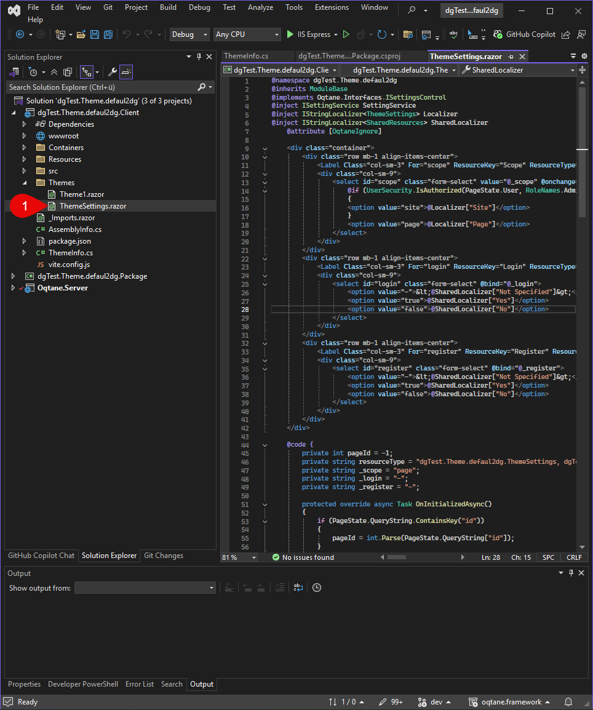

# Theme Settings in Oqtane

This section explains what Theme Settings in Oqtane are, where they are located, how they are stored and loaded, and how they differ between site and page level.

Theme Settings are configurable options that allow you to customize the appearance and behavior of a theme in Oqtane. They enable administrators to centrally or page-specifically manage design and layout options without having to directly modify the code.

---

## Overview of Theme Settings

**Where are Theme Settings located in the UI?**

- Theme Settings can be accessed via the Oqtane admin panel.
- Navigate to "Site Management" → "Themes".
- When selecting an active theme, you will find a section for theme-specific settings.
- Additionally, Theme Settings can often be adjusted directly on a page in the "Page Settings" dialog, if supported by the theme.

**Where are Theme Settings located in the code?**

- Theme Settings are defined in the `Theme.razor` or a specific `Settings.razor` file of the theme.
- The settings are often modeled via classes like `ThemeSettings`, a POCO object, within the theme project.
- Access to the settings in the theme code is done via Dependency Injection or through Oqtane’s Settings API.

  

**What can you do with Theme Settings?**

- Customize colors, fonts, spacing, and other styles.
- Control the visibility of components (e.g., logo, navigation).
- Include custom CSS/JS.
- Provide custom options for specific theme functionality.

---

## Site vs. Page Settings

**Difference Between Site Settings and Page Settings**

- **Site Settings**: Apply globally to the entire website. Changes affect all pages.
- **Page Settings**: Apply only to a specific page and may override the Site Settings for that page.

**How Are These Merged?**

- When rendering a page, the Site Settings are loaded first.
- If Page Settings exist for the current page, they override the corresponding values from the Site Settings (merge mechanism).
- The resulting settings object is a combination of global and page-specific settings.

---

**Summary:**  
Theme Settings in Oqtane provide flexible customization of a theme's appearance and behavior—globally or per page. They can be configured both in the UI and in code, and are uniquely identified and managed via namespaces.

---

## Example: Refactored Custom Settings in the Oqtane Basic Theme

In the Oqtane Basic Theme, the handling of Theme Settings has been refactored and extended with custom settings. This provides a flexible way to manage design options and special features directly through the Oqtane UI.

> [!TIP]
> [Oqtane Basic Settings](xref:Cre8magic.MagicThemes.Settings.Index)