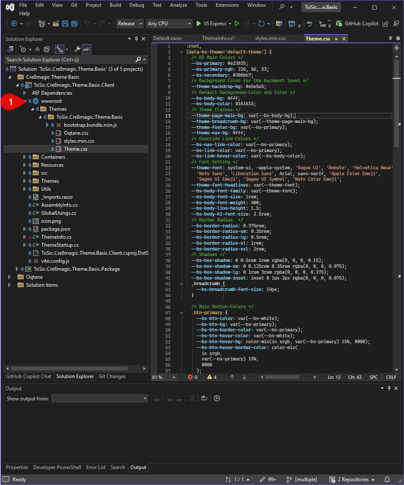
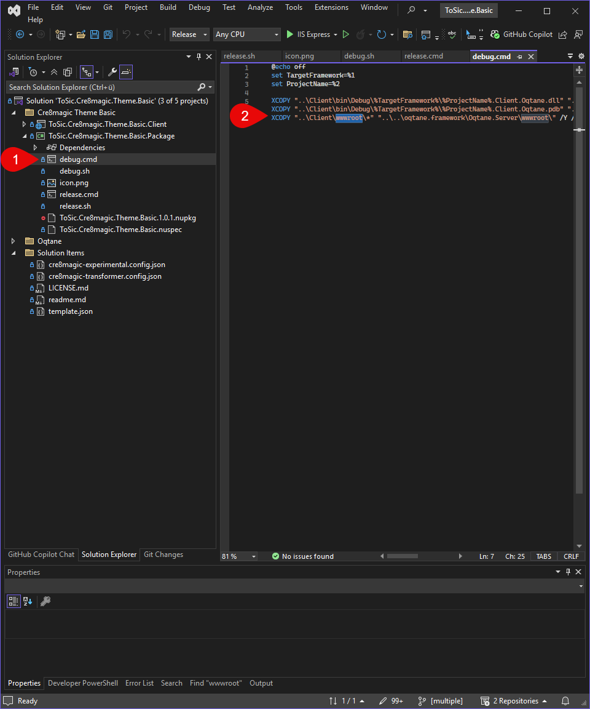

# The `wwwroot` Folder

> [!TIP]
> If you use external libraries like Bootstrap, FontAwesome, or custom JS scripts, place them in
`wwwroot` and reference them using the `Resources` list in your `ThemeInfo`.

The `wwwroot` folder is the **web root directory** of an Oqtane theme or web application. All files that should be publicly accessible via the browser are placed here.

<div gallery="gallery01">
  
</div>

Typical contents include:

- **CSS files** (`.css`)
- **JavaScript files** (`.js`)
- **Images** (`.png`, `.jpg`, `.svg`, etc.)
- **Fonts** (`.woff`, `.ttf`, etc.)

For example, if you place a file called `styles.min.css` inside your theme’s `wwwroot` folder, you can reference it in your `ThemeInfo.cs` like this:

```csharp
Resources =
 [
  new Stylesheet("~/styles.min.css")
 ]
```

Here, the ~ refers to the root of the `wwwroot` folder of the current theme or module.

## Important Notes

- Only files inside the wwwroot folder are directly accessible via URL.
- Logic files, Razor components, or C# code should not be placed in this folder.
- The structure and naming inside wwwroot should be consistent and well organized.
- In Debug Build, copy the Output to the Oqtane Server

<div gallery="gallery02">
  
</div>

