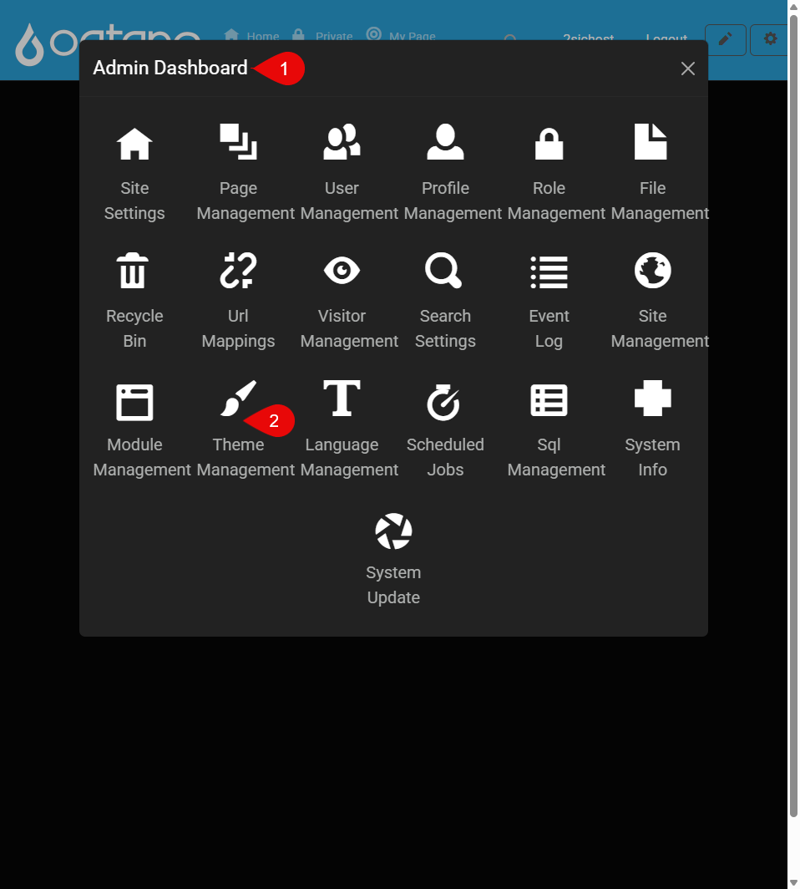
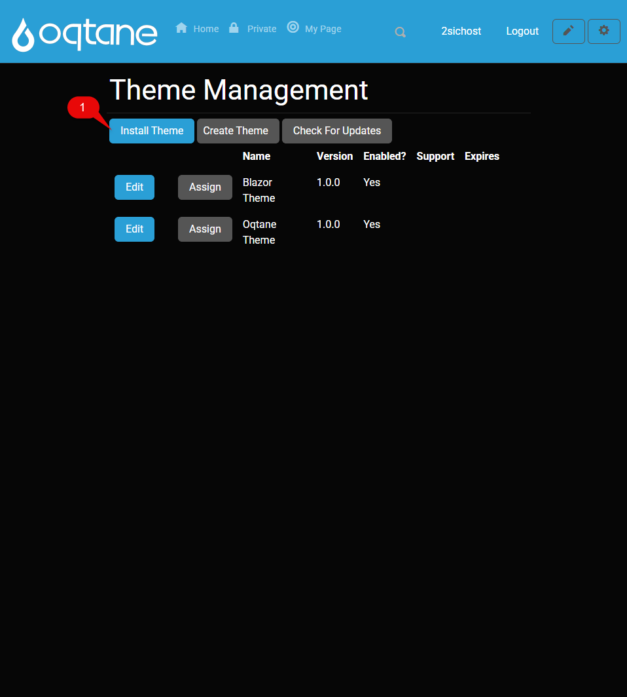
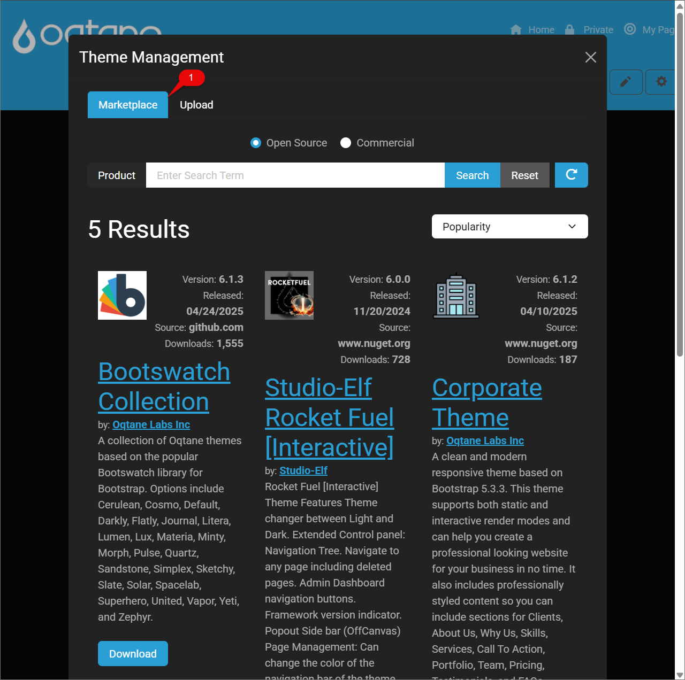
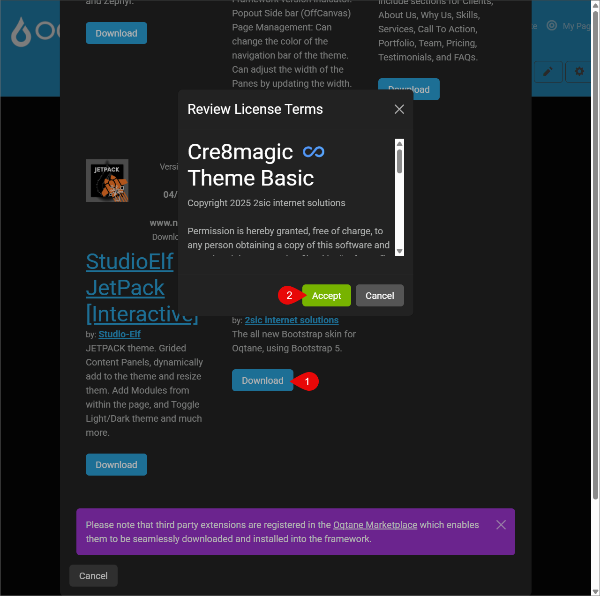
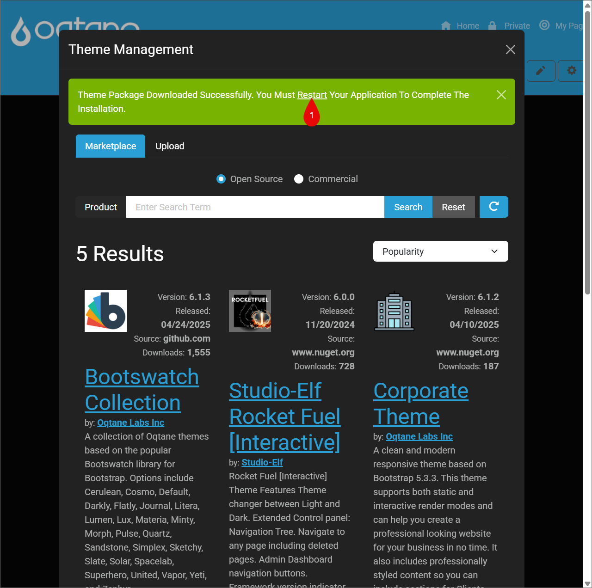
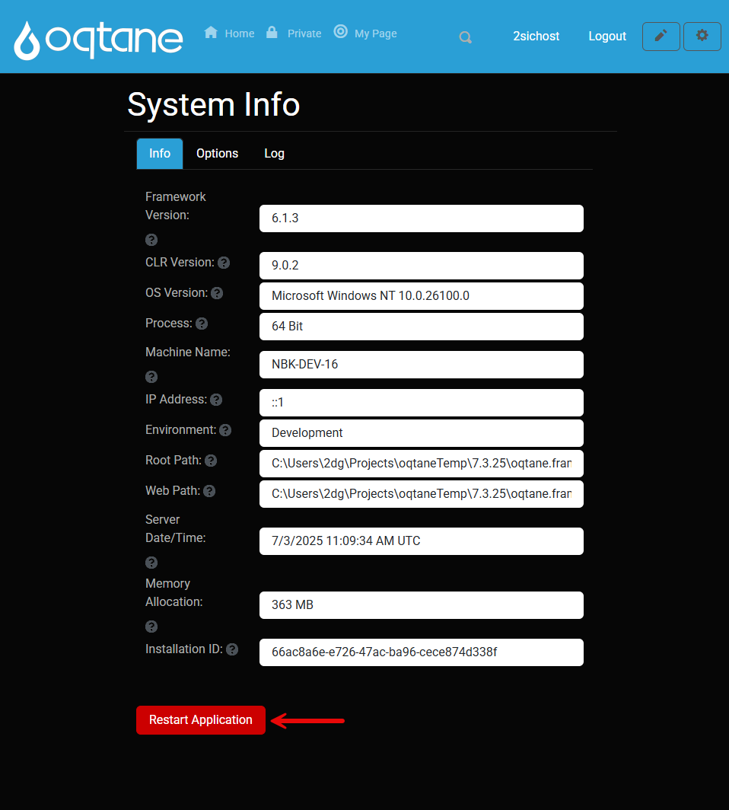
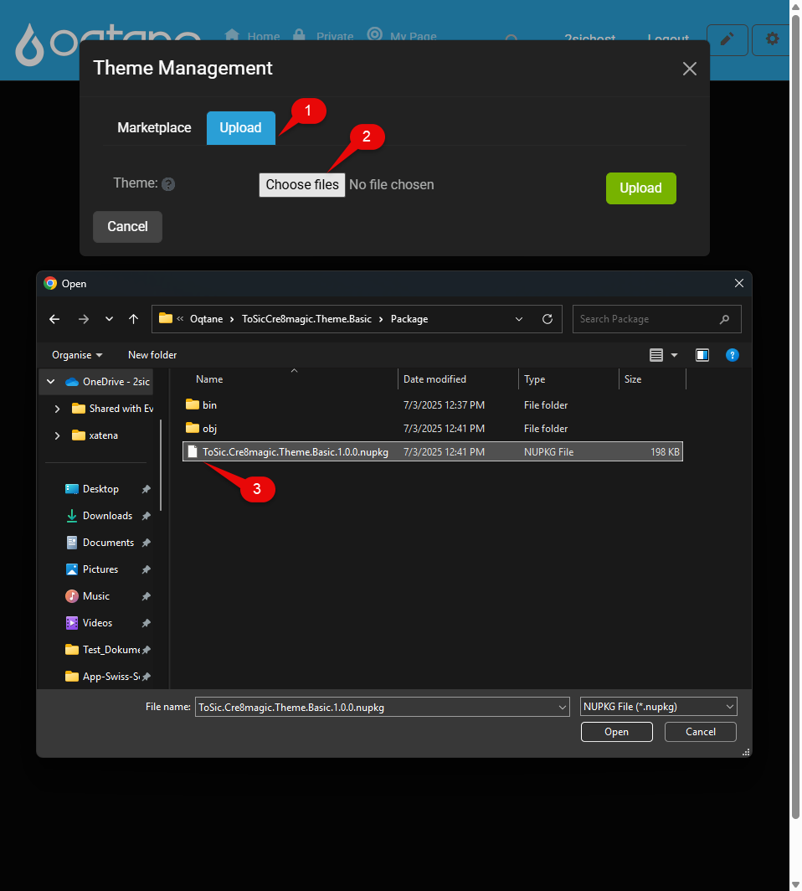
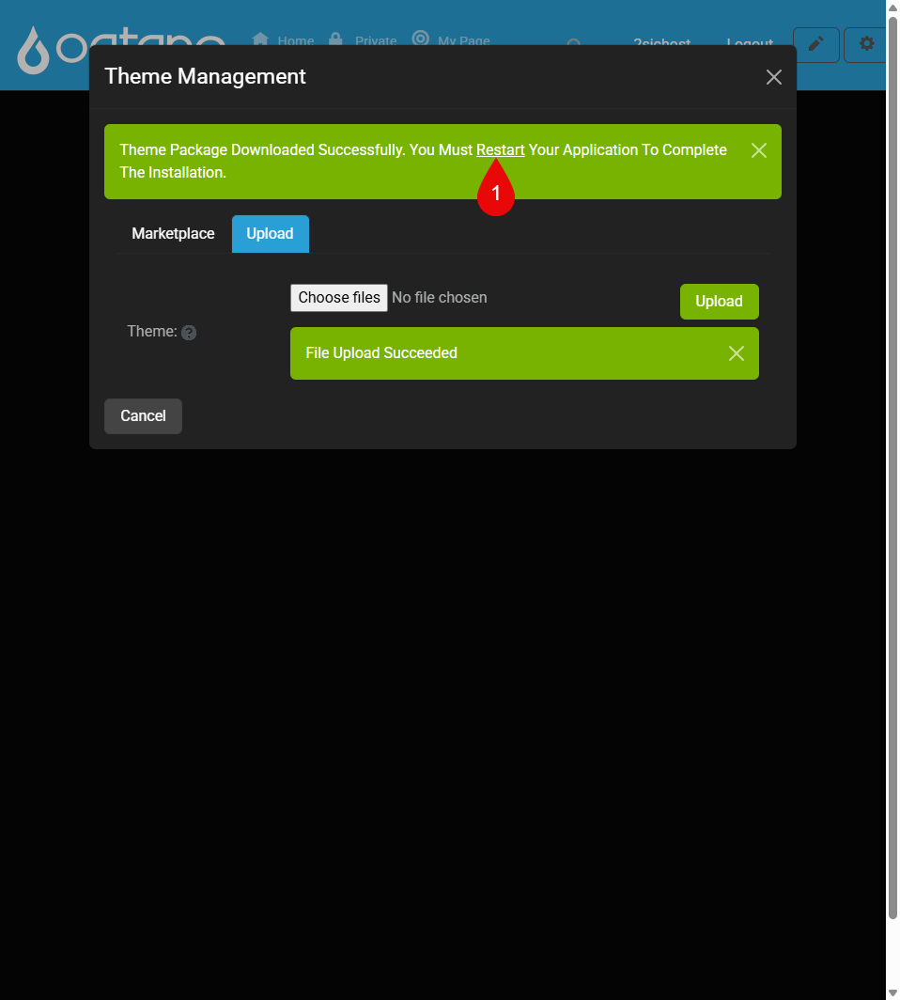

# Install Theme Guide

This guide will walk you through the two different methods of installing a custom theme in Oqtane: via the official Marketplace or by uploading a NuGet package manually. Both options are suitable depending on whether the theme is published online or developed locally.

> [!TIP]
> Make sure your theme is built and packaged correctly before installation. You will need a .nupkg file to upload it manually or a published release to use the marketplace..

---

## Install from Marketplace

  Open the Admin Dashboard   Go to Theme Management">
  Click Install Theme">
  Select the Marketplace tab">
  Download and Accept the theme">
  Download Successfully, Restart the Application to activate the theme">
  Restart the Applicatctio">

To install a theme from the **Oqtane Marketplace**:

1. Open your **Admin Dashboard** and Go to **Theme Management**
2. Click **Install Theme**
3. Switch to the **Marketplace** tab
4. Click **Download** next to the desired theme and **Accept**
5. Finally, click **Restart Application** to activate it

**Note:**  

* On a **local environment**, you can restart directly from **Visual Studio**.  
* On a **server**, go to **System Info > Restart Application**.

---

Don’t have a `.nupkg` file yet?
Learn how to build one in [How to Build a NuGet Theme](xref:OqtaneThemes.PublishTheme.Index)

## Install from NuGet Package

  Open Theme Management">
  Upload your .nupkg file">
  Restart the application">

To manually install a theme using a `.nupkg` file:

Don’t have a `.nupkg` file yet?
Learn how to build one in [How to Build a NuGet Theme](xref:OqtaneThemes.PublishTheme.Index)

1. Go to **Admin Dashboard** → **Theme Management**
2. Click **Install Theme** and switch to the **Upload** tab
3. Select your `.nupkg` file and upload it
4. After upload, click **Restart Application**

**Note:**  

* On a **local environment**, you can restart directly from **Visual Studio**.  
* On a **server**, go to **System Info > Restart Application**.