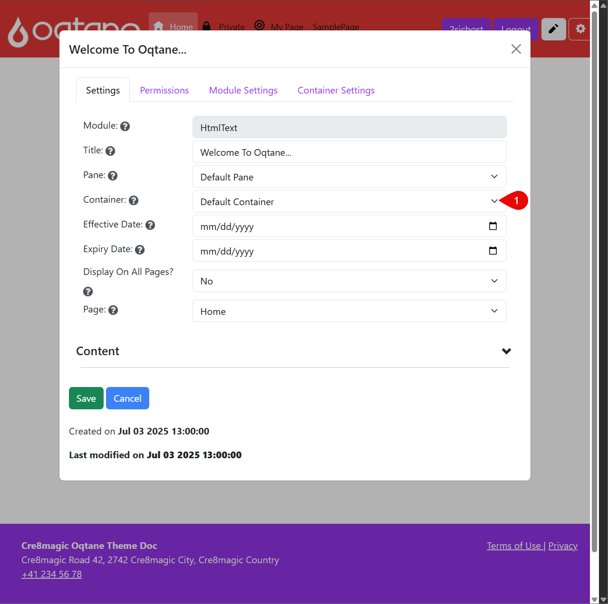
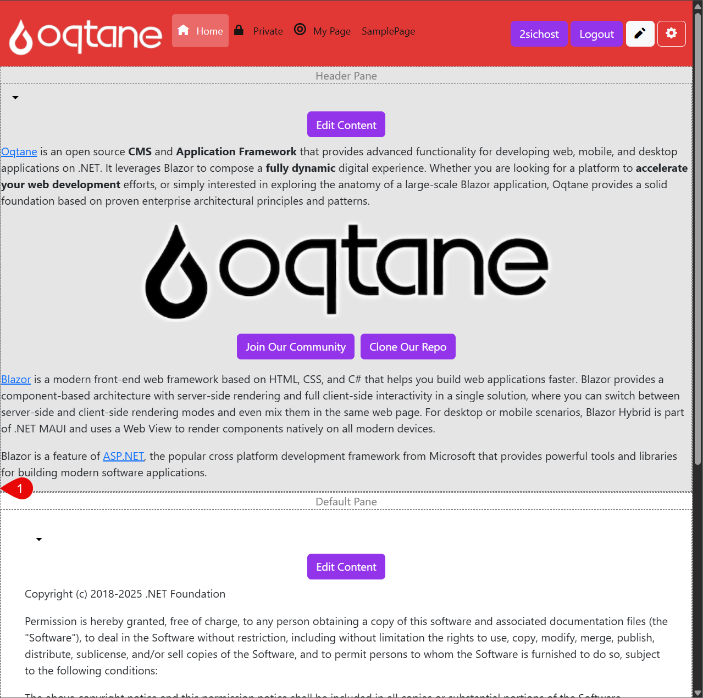

# How to Change the Container

This section shows how to change the ***Container** for a module on a page.

  
  
  
  

Steps to Change the Container

1. Go to the page containing your module and click the **Edit icon** (pencil) to enter edit mode.

2. Click the **dropdown arrow** next to the module, then select **Manage Settings**.
3. In the module settings dialog, choose a different **Container** from the dropdown list.
This will affect how the module is displayed visually.
4. Click save and close the Dialog to see the Changes
