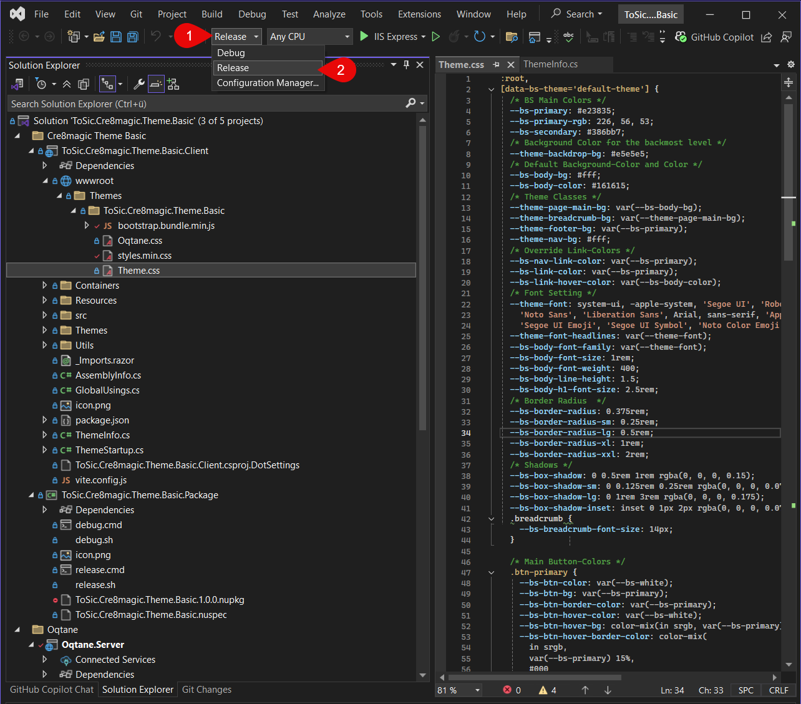
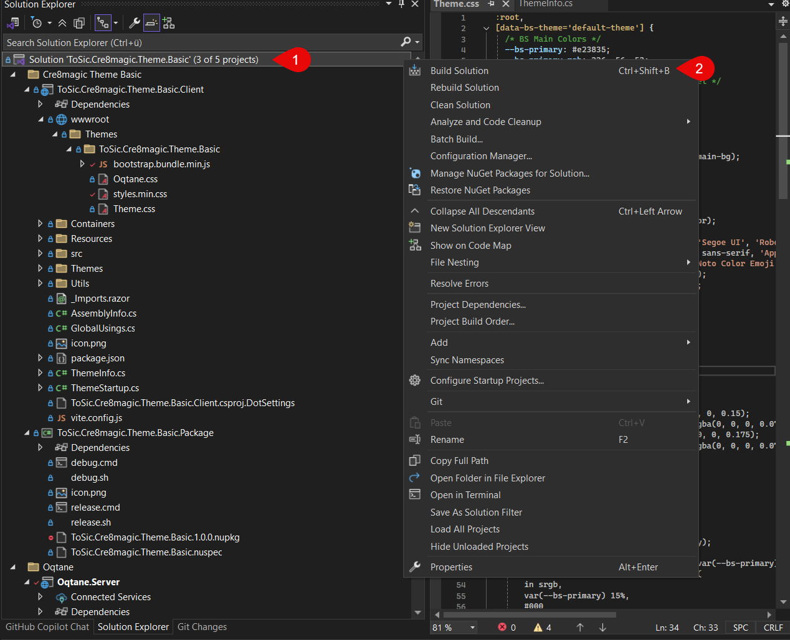
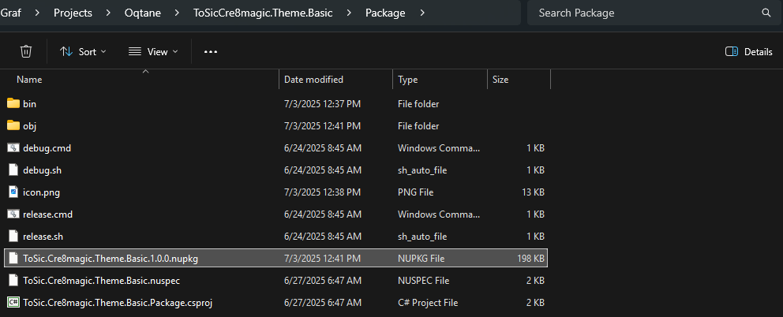
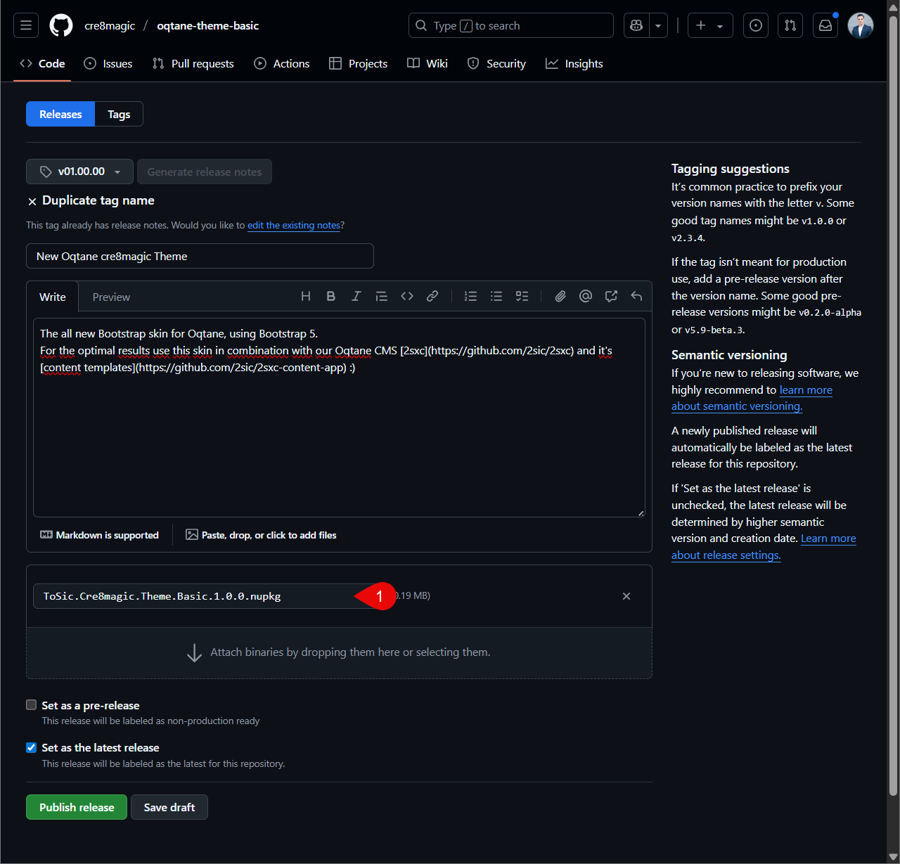
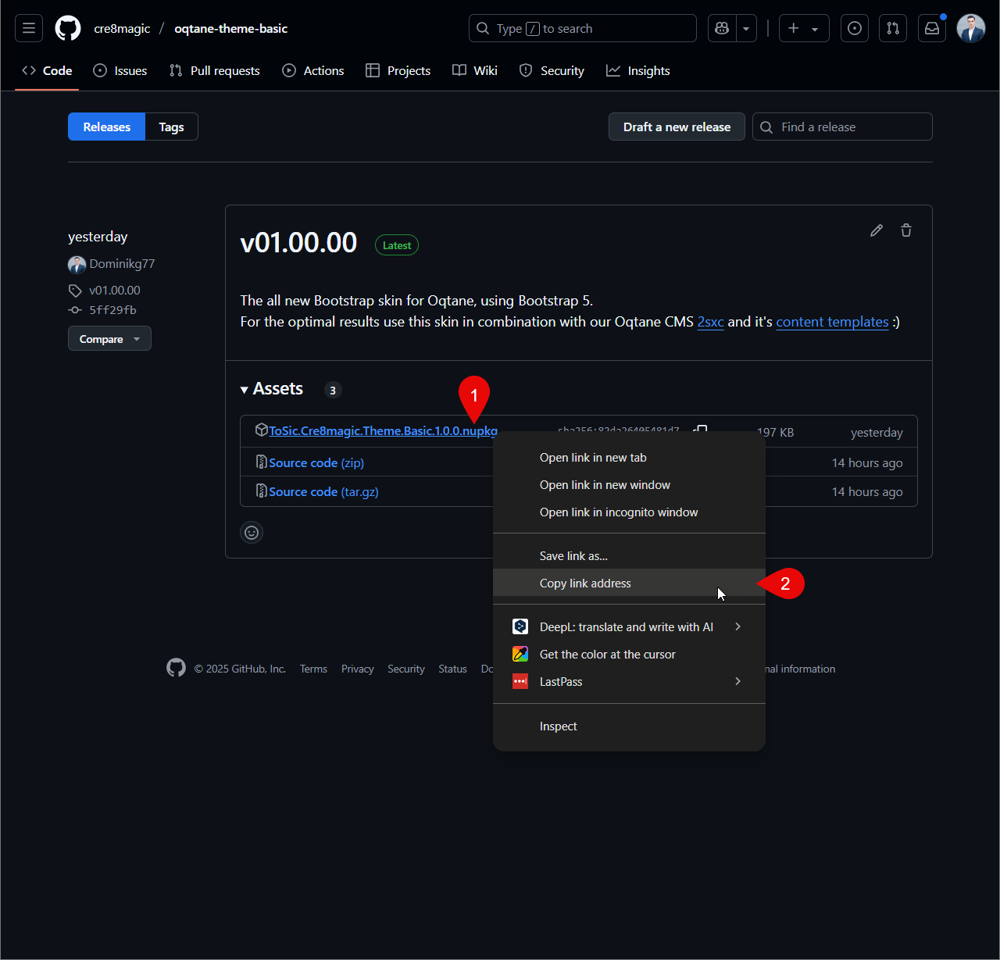
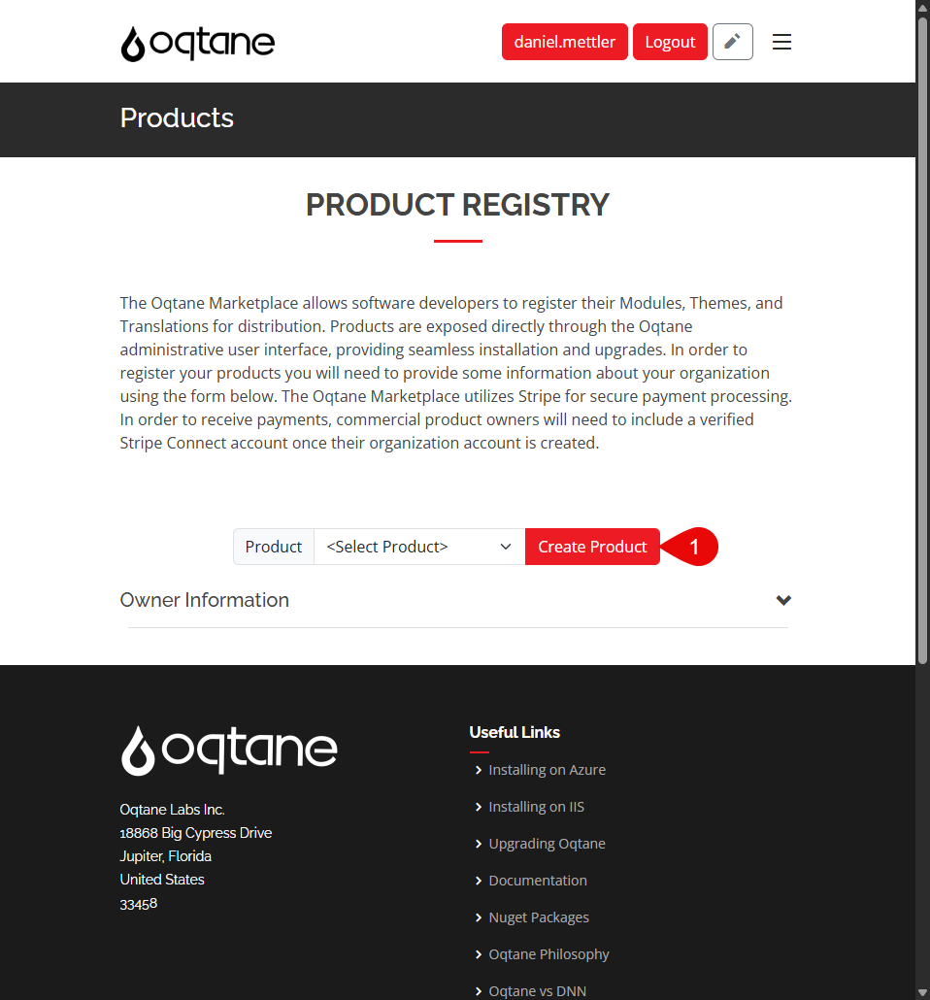
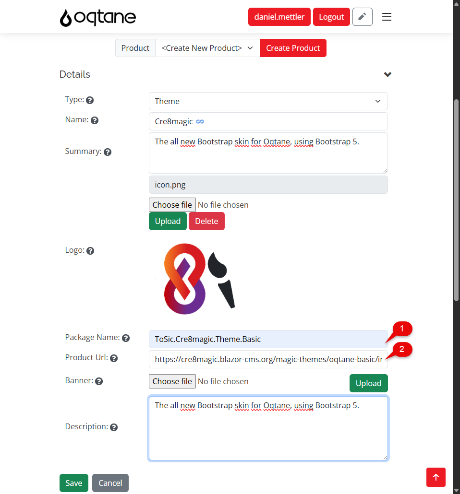
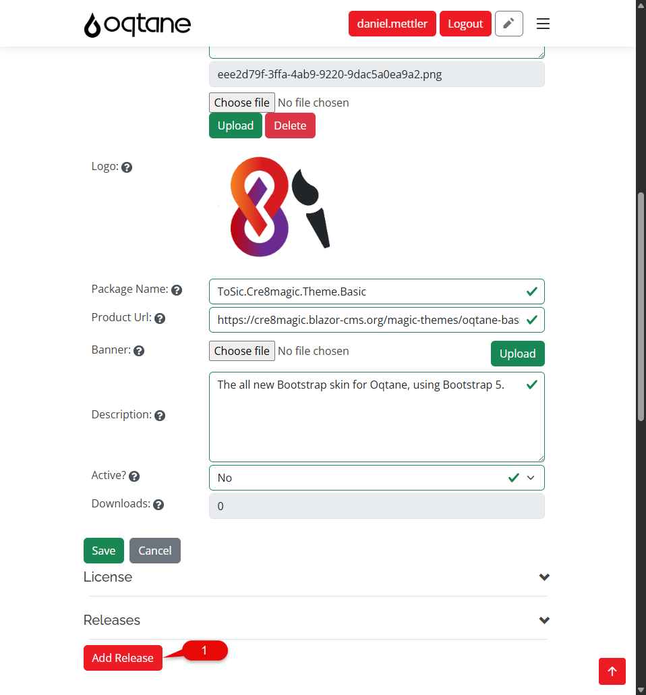
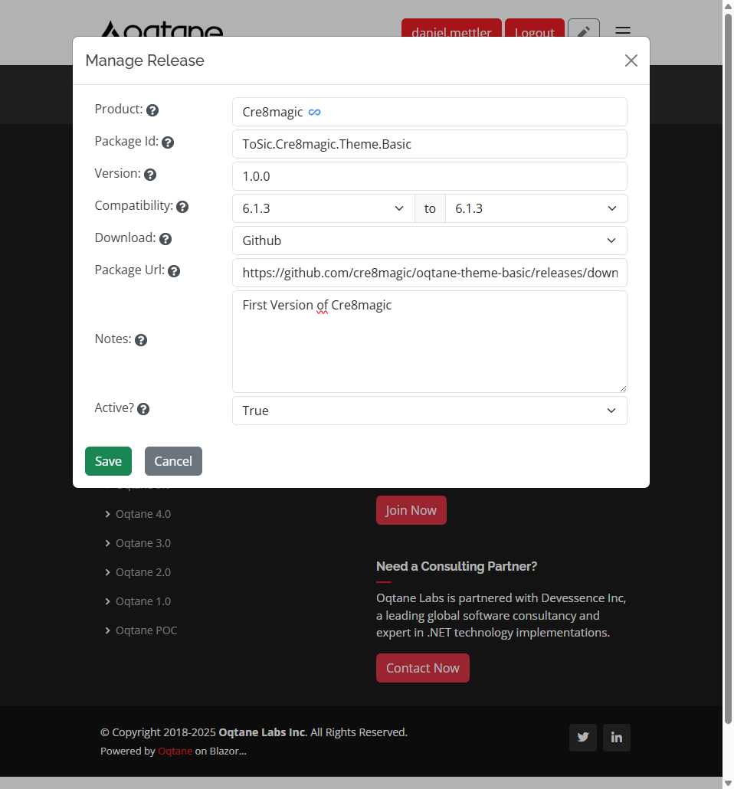

# Publish Theme Guide

This guide shows you how to prepare and publish your Oqtane theme so it can be reused or shared through the official Marketplace.  
Whether you’ve built a custom theme for your own use or want to share it with the community, this step-by-step guide will help you get it ready.

> [!TIP]
> Before publishing, make sure your theme builds without errors.  
> After publishing, make sure to test the installation of your theme from the Marketplace to verify that everything works correctly.

---

## Create a NuGet Package

  Switch to a Release Build">
  Build your project">
  Your NuGet package is now available">

To prepare your theme for distribution, you first need to create a **Release** build of your project.

Refer to the screenshots above.

Was your build successful?  
Great!

Want to test your theme locally before publishing it?  
Check out [How to Install a NuGet Theme](xref:OqtaneThemes.Installation.Index)

---

## Upload to GitHub

  Create a new release">
  Upload the NuGet package">
  Copy the download link">

After a successful build, your `.nupkg` file will be ready.  
Now it's time to upload it to **GitHub**:

1. Create a **new release**
2. Upload your NuGet package (`.nupkg`)
3. Once published, copy the **direct download link** – this link will be needed to install the theme in Oqtane

---

## Publish to the Oqtane Marketplace

  Create a new product">
  Fill in the product info">
  Add a new release">
  Provide release details">

To publish your theme:

1. Go to [Oqtane.net](https://www.oqtane.net) and log in.
2. Navigate to **Products** and create a new product.
3. Enter a **Package Name** and a **GitHub repository link** (not a direct release link).

Then:

1. Click **Add Release**
2. Upload or link your `.nupkg` file
3. Save – your theme is now available in the **Oqtane Marketplace**

Your theme will be listed and available in the **Oqtane Marketplace** for others to install

<iframe src="https://azing.org/oqtane/r/kFsv_Vty?embed=1" width="100%" height="400" frameborder="0" allowfullscreen style="box-shadow: 0 1px 3px rgba(60,64,67,.3), 0 4px 8px 3px rgba(60,64,67,.15)"></iframe>