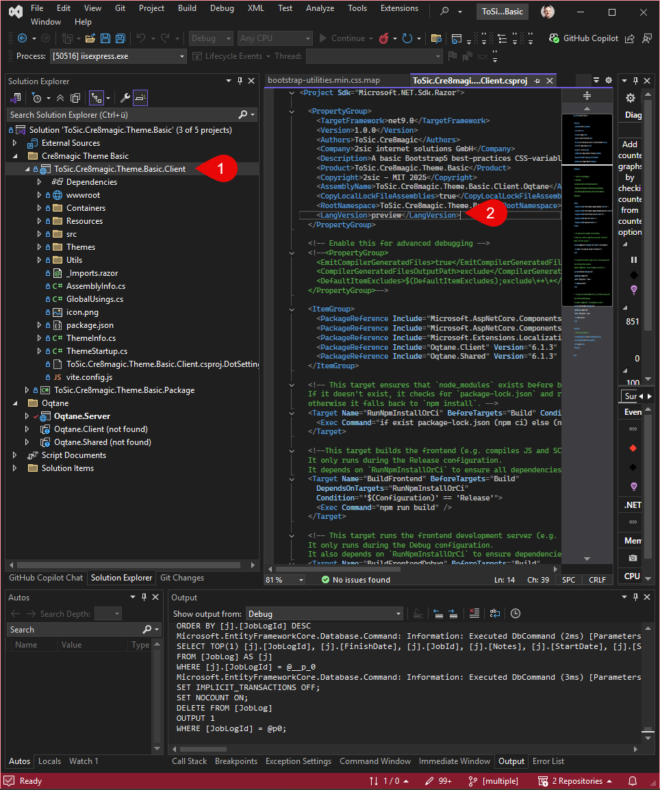
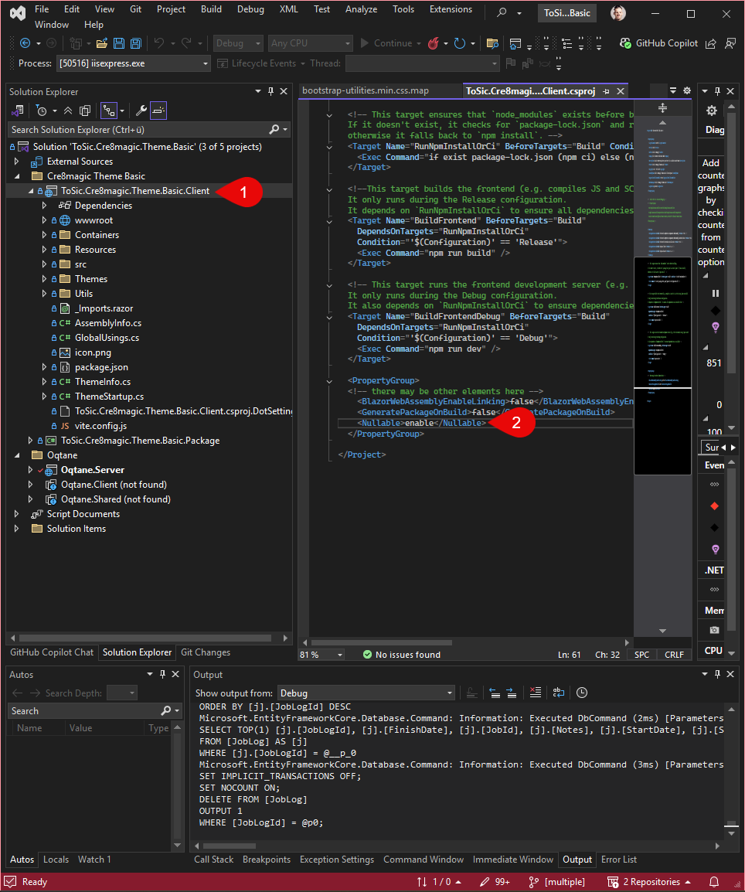

# C# Recommendations

## Use the Preview Version

Open your `.csproj` file and add the following entry inside the `PropertyGroup`:

```xml
<LangVersion>preview</LangVersion>
```

<div gallery="gallery01">
  
</div>

## Enable Nullable

To allow the compiler to perform proper null checks, enable nullable reference types:

```xml
<Nullable>enable</Nullable>
```

<div gallery="gallery02">
  
</div>

---

## New in C# 14

[MicrosoftC C# 14](https://learn.microsoft.com/en-us/dotnet/csharp/whats-new/csharp-14)


### `field` Keyword

New in C# 14: The `field` keyword can be used to directly access the underlying field of an auto-property.

Since we have already enabled nullable reference types, we can specify that `field` may be null:

```csharp
[field: AllowNull, MaybeNull]
private MyContainerSettings Settings => field ??= new(OqtaneSettings.GetModule(ModuleState));
```

### Unbound generic types and `nameof`

As of C# 14, the `nameof` operator can also be used with **unbound** generic types. This means you can retrieve the name of a generic type without specifying its type parameters.

```csharp
// Now works – without type parameters
string listName = nameof(List<>);     // Result: "List"
string dictName = nameof(Dictionary<,>);  // Result: "Dictionary"
```

### Simple lambda parameters

You can now use parameter modifiers such as ref, out, in, scoped, or ref readonly in lambda expressions – even without explicitly specifying the parameter type.

```csharp
// Delegate definition
delegate bool TryParse<T>(string text, out T result);

// Lambda without type specification – now works!
delegate bool TryParse<T>(string text, out T result);
// ...
TryParse<int> parse1 = (text, out result) => Int32.TryParse(text, out result);
```

### Null-conditional assignment

The null-conditional operators ?. and ?[] can now also be used on the left-hand side of assignments.

Before:

```csharp
if (customer is not null)
{
    customer.Order = GetCurrentOrder();
}
```
Now:

```csharp
customer?.Order = GetCurrentOrder();
```
