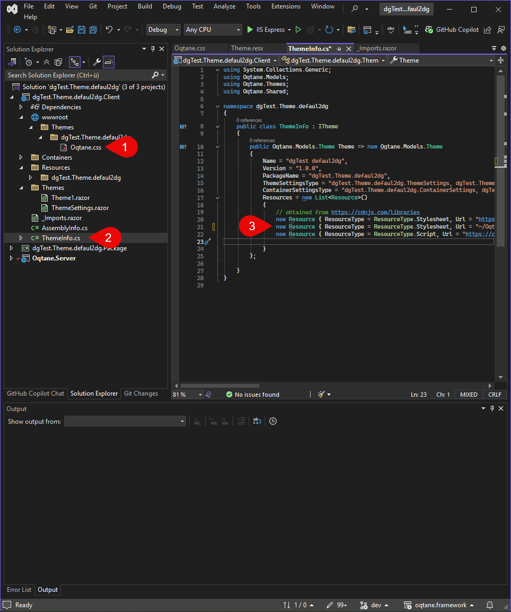

# Oqtane Blazor Theme Assets

Every theme needs assets, such as images, stylesheets, and scripts.
This guide will help you understand how to manage and use assets in your Oqtane themes effectively.

> [!TIP]
> A core aspect of modern css and javascript is the use of SASS and TypeScript.
> This guide will help you understand how to use these technologies in your Oqtane themes.

## All About Theme Assets

Each theme can define its own CSS classes and variables. When creating a new theme, the default Oqtane CSS definitions are already included in the `theme.css` file.

In our case, however, we moved these CSS definitions into a separate file called `oqtane.css`. The reason for this is that the default CSS files may change with Oqtane updates. By outsourcing them to a custom file, we can easily copy and reuse the original styles without overwriting them directly.

To ensure that a new CSS file is included in the final theme, it must be placed in the following directory during compilation:

`wwwroot/themes/YOUR_THEME_NAME`

Your CSS file should be located here.

  

To make sure the CSS file is loaded in the final theme, it must be declared in the `ThemeInfo.cs` file. During the build process, the file will then be automatically copied to the  
`wwwroot/themes/YOUR_THEME_NAME` folder and will be included when the theme is loaded.

Bootstrap 5 is loaded via CDN by default.

TODO: @2dg explain what they are, where they are located at runtime, etc.

## Stylesheets using SASS

TODO: @2dg explain how to use SASS in Oqtane themes, including how to set up the project, write SASS code, and compile it to CSS.

## JavaScript using TypeScript

TODO: @2dg explain how to use TypeScript in Oqtane themes, including how to set up the project, write TypeScript code, and compile it to JavaScript.

## Running Vite to Compile Styles and Scripts

TODO: @2dg explain how to run Vite to compile styles and scripts, including how to set up the project, configure Vite, and run the build process.
don't forget to mention how it works, and how it runs automatically when you build...