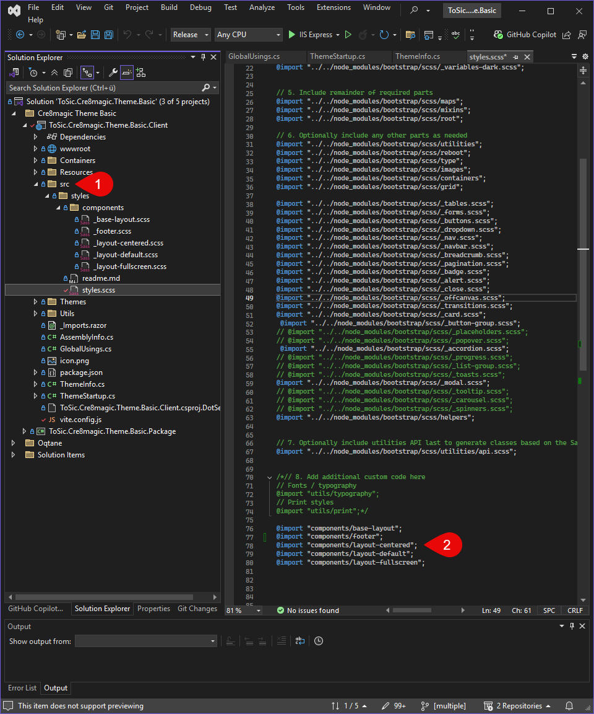

# Using SASS in Oqtane Themes

SASS (Syntactically Awesome Stylesheets) is a CSS extension that provides powerful features like variables, nesting, mixins, and more — making it easier and more structured to manage your stylesheets. You can easily use SASS in Oqtane themes, provided that your development setup is properly configured.

## Project Setup

To use SASS in your Oqtane theme, make sure your project supports `.scss` files and compiles them into regular CSS during the build process. Here's how to get started:

- Ensure your theme project is a web project with access to tools like `sass`, `vite`, or `gulp`.
- Install the SASS compiler using Vite.  
  📘 [How to Install Vite](xref:OqtaneThemes.ThemeAssets.Vite.Index)
- Create a folder structure for your SASS or styles, for example:

In `style.scss`, all other SCSS files should be imported to ensure they are loaded correctly.

<div gallery="gallery01">
  
</div>

---

## Writing SASS Code

SASS allows you to write modular and maintainable styles. You can define variables and reuse them across multiple files:

```scss
// _variables.scss
$primary-color: #007bff;
$font-stack: 'Segoe UI', sans-serif;

// _layout.scss
body {
  font-family: $font-stack;
  background-color: $primary-color;
}
```

---

## Compiling SASS

<div gallery="gallery02">
  
</div>

Refer to the **Vite** section to see how to configure the build process correctly.

Once everything is set up properly, a `styles.min.css` file will be generated in the `wwwroot/themes/YOUR_THEME_NAME` directory after rebuilding the project.

