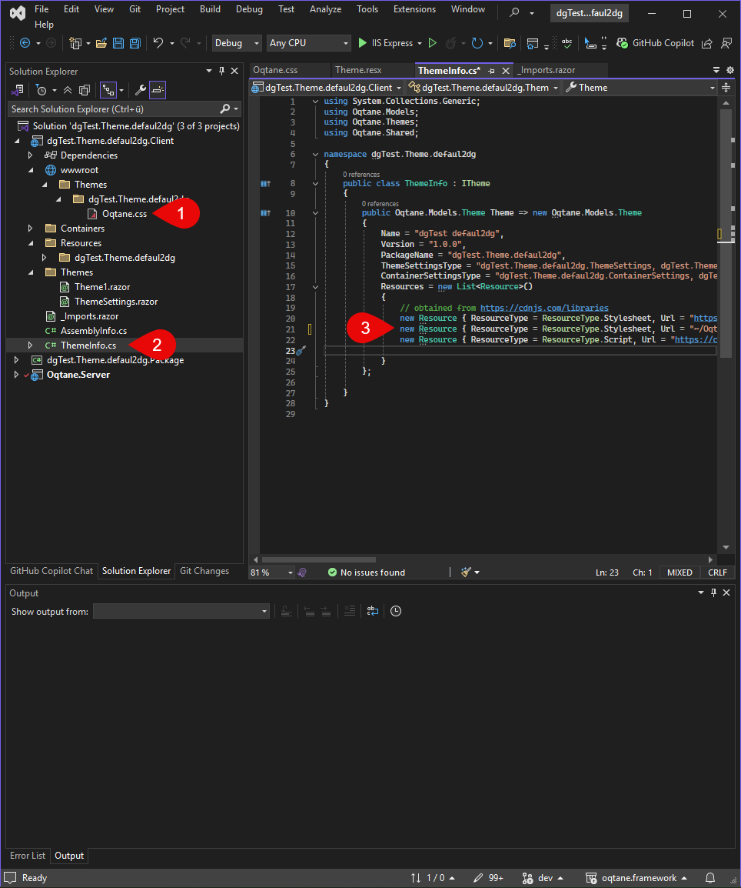

# Styles

## Using CSS in Oqtane Themes


Each Oqtane theme can define its own CSS classes, variables, and component-specific styles. When you create a new theme, the default styling from the Oqtane framework is typically included via a `theme.css` file. This provides a solid base that ensures consistency and compatibility with built-in modules and layout components.

However, in many projects, it's a good idea to separate the original framework styles from your customizations. For example, we moved the default Oqtane CSS into a separate file named `oqtane.css`. This approach offers two key benefits:

- It protects your custom theme from breaking changes when Oqtane is updated.
- It allows you to copy and reference the original styles without directly modifying them.

### Including CSS Files in Your Theme

To include your custom CSS file in the final output, it must be placed in the following directory during the build process: `wwwroot/themes/YOUR_THEME_NAME`

<div gallery="gallery01">
  
</div>

To make sure the CSS file is loaded in the final theme, it must be declared in the `ThemeInfo.cs` file. During the build process, the file will then be automatically copied to the  
`wwwroot/themes/YOUR_THEME_NAME` folder and will be included when the theme is loaded.

Bootstrap 5 is loaded via CDN by default.

---

## Using SASS in Oqtane Themes

SASS (Syntactically Awesome Stylesheets) is a CSS extension that provides powerful features like variables, nesting, mixins, and more — making it easier and more structured to manage your stylesheets. You can easily use SASS in Oqtane themes, provided that your development setup is properly configured.

- Variables
- Nesting
- Functions
- Mixins
- Imports

Using SASS can significantly improve your development workflow by keeping your styles modular, readable, and easier to maintain.

---

## Project Setup for SASS

To use SASS in your Oqtane theme, make sure your project supports `.scss` files and compiles them into regular CSS during the build process. Here's how to get started:

- Ensure your theme project is a web project with access to tools like `sass`, `vite`, or `gulp`.
- Install the SASS compiler using Vite.  
  📘 [How to Install Vite](xref:OqtaneThemes.ThemeAssets.Vite.Index)
- Create a folder structure for your SASS or styles, for example:

In `style.scss`, all other SCSS files should be imported to ensure they are loaded correctly.

<div gallery="gallery01">
  
</div>

---

## Writing SASS Code

SASS allows you to write modular and maintainable styles. You can define variables and reuse them across multiple files:

#### SCSS-Code

```scss
// _variables.scss
$primary-color: #007bff;
$font-stack: 'Segoe UI', sans-serif;

// _layout.scss
body {
  font-family: $font-stack;
  background-color: $primary-color;
}
```

#### Generated CSS

```css
body {
  font-family: 'Segoe UI', sans-serif;
  background-color: #007bff;
}
```

---

### Compile SASS Code

FLOW CHART: 
flowchart LR
    A(["VS Build Starts"]) --> B["Run Vite Build"]
    B --> C["Vite Compiles SASS to CSS"]
    C --> D["Vite Copies CSS to /wwwroot/themes/YOUR_THEME"]
    D --> E["Oqtane Loads Compiled CSS at Runtime"]
    E --> F(["Done"])

Run > X CODE 

Resultat in wwwroot

---

## Show Compile SASS Code

<div gallery="gallery02">
  
</div>

Refer to the **Vite** section to see how to configure the build process correctly.

Once everything is set up properly, a `styles.min.css` file will be generated in the `wwwroot/themes/YOUR_THEME_NAME` directory after rebuilding the project.

If changes are not visible, check the `styles.mini.css` file's timestamp to make sure it is correct.