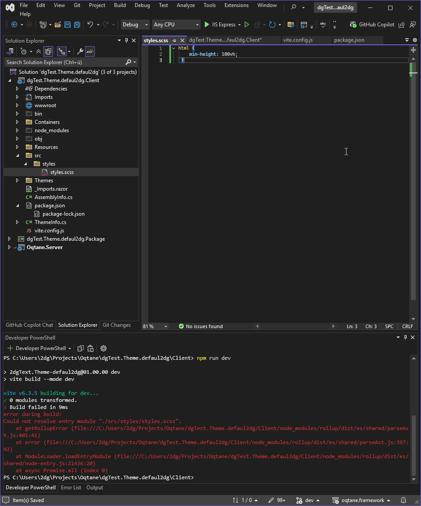
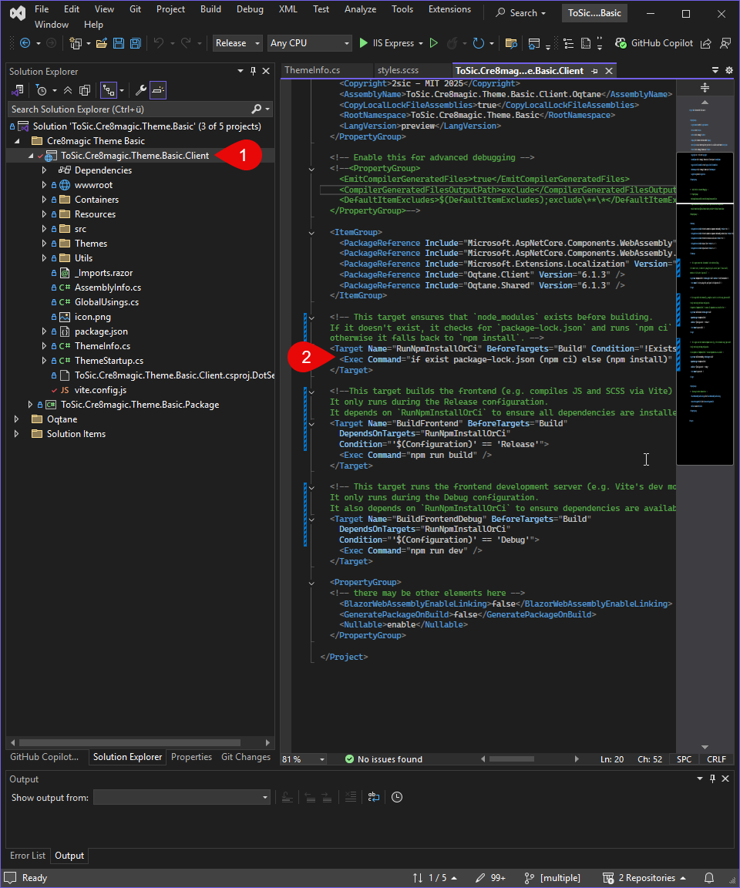

## What is Vite?

[Vite](https://vitejs.dev) is a modern build tool and development server, designed for
fast and efficient workflows in web projects using JavaScript, TypeScript, Vue, React,
or even plain SCSS/CSS. 
Compared to older tools like Webpack, Vite offers significantly faster startup and compilation times
thanks to its use of native ES modules and efficient hot module replacement (HMR).

### What is Vite used for in Oqtane?

In Oqtane themes, we use Vite to:

- **Compile SCSS files into CSS**
- **Bundle and optimize JavaScript or TypeScript code**

---

## Vite Setup – Schritt-für-Schritt

<div gallery="gallery02">
  
  

</div>

### 1. Create `package.json`

In the root directory of your theme project, create (or update) a `package.json` file with the necessary dependencies. Example:

```json
{
  "name": "ToSic.Cre8magic-Theme-Basic", // Change Name
  "version": "01.00.00",
  "main": "(none)",
  "scripts": {
    "dev": "vite build --mode dev",
    "build": "vite build",
    "watch": "vite build --watch"
  },
  "author": "2sic internet solutions", // Change Author
  "license": "MIT",
  "dependencies": {
    "bootstrap": "^5.3.3"
  },
  "devDependencies": {
    "autoprefixer": "^10.4.7",
    "rollup-plugin-copy": "^3.5.0",
    "sass": "^1.58.0",
    "typescript": "^5.0.0",
    "vite": "^6.1.0",
    "vite-plugin-static-copy": "^2.3.0"
  }
}
```

---

### 2. Prepare Theme File

In your `.csproj` file or in the `ThemeInfo.cs`, ensure that the compiled files  
(e.g., `styles.min.css`, `bundle.js`) are automatically copied to the folder `wwwroot/themes/YOUR_THEME` during the build process.  
You can find an example on GitHub here (adjust the link if needed).

---

### 3. Example vite.config.ts

The configuration file `vite.config.ts` controls how Vite handles your SCSS and JS files.

Here is an example of a simple Vite configuration:  
[Simple Vite config on GitHub](https://github.com/cre8magic/oqtane-theme-basic/blob/main/Client/vite.config.js)

### 4. Adjusting the Client Code

After a successful setup, you can build your theme by running the command `npm run build`.  
This will compile your SCSS files into an optimized CSS file (`styles.min.css`) and copy it to the correct directory.  
The same applies for your JS/TS files.

```xml
  <!-- This target ensures that `node_modules` exists before building.
  If it doesn't exist, it checks for `package-lock.json` and runs `npm ci` (clean install),
  otherwise it falls back to `npm install`. -->
  <Target Name="RunNpmInstallOrCi" BeforeTargets="Build" Condition="!Exists('node_modules')">
    <Exec Command="if exist package-lock.json (npm ci) else (npm install)" />
  </Target>

  <!--This target builds the frontend (e.g. compiles JS and SCSS via Vite) using `npm run build`.
  It only runs during the Release configuration.
  It depends on `RunNpmInstallOrCi` to ensure all dependencies are installed first.-->
  <Target Name="BuildFrontend" BeforeTargets="Build"
    DependsOnTargets="RunNpmInstallOrCi"
    Condition="'$(Configuration)' == 'Release'">
    <Exec Command="npm run build" />
  </Target>

  <!-- This target runs the frontend development server (e.g. Vite's dev mode) using `npm run dev`.
  It only runs during the Debug configuration.
  It also depends on `RunNpmInstallOrCi` to ensure dependencies are available -->
  <Target Name="BuildFrontendDebug" BeforeTargets="Build"
    DependsOnTargets="RunNpmInstallOrCi"
    Condition="'$(Configuration)' == 'Debug'">
    <Exec Command="npm run dev" />
  </Target>
```

