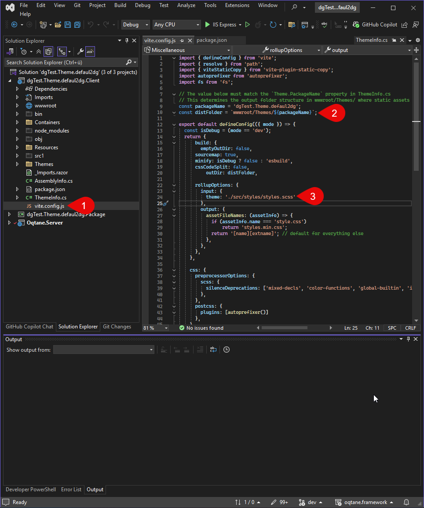
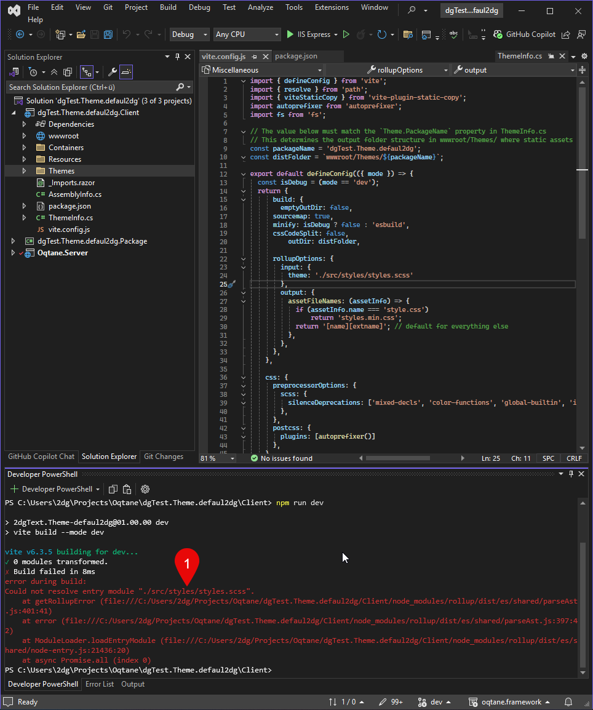

# What is Vite?

[Vite](https://vitejs.dev) is a modern build tool and development server, designed for
fast and efficient workflows in web projects using JavaScript, TypeScript TODO:LINK, Vue, React,
or even plain SCSS/CSS TODO:LINK.

Compared to older tools like Webpack, Vite offers significantly faster startup and compilation times
thanks to its use of native ES modules and efficient hot module replacement (HMR).

In Oqtane themes, we use Vite to:

- **Compile SASS/SCSS files into CSS**
- **Bundle and optimize JavaScript or TypeScript code**

When properly configured, vite will automatically build your source assets into optimized files
whenever you build your Oqtane theme.
This is how it works:

```mermaid
graph LR;
    A["📄 Many Source Files <br> (TypeScript, SASS, ...)"] --> B["⚙️ Vite"]
    B --> C["🎁 Optimized Files <br> (.min.css, .min.js)"]
    C --> D["🩸 Oqtane Theme"]
```



---

## What do you need for Vite?

To get started with Vite, follow these basic steps:

1. **Install the required Node modules**  
   Begin by installing all necessary dependencies for your project.
2. **Add the Vite configuration**  
   Once the modules are installed, copy or create your Vite config file and run the build process.  
   You should now see outputs like `style.min.css` being generated.
3. **Verify automatic builds**  
   Confirm that Vite correctly generates new files or updates them after every build or when you change your source code.

---

## 1. Setup Node Modules

### 1.1 Create `package.json`

In the root directory of your theme project, create (or update) a `package.json` file with the required dependencies. For example:

```json
{
  "name": "ToSic.Cre8magic-Theme-Basic",
  "version": "01.00.00",
  "scripts": {
    "dev": "vite build --mode dev",
    "build": "vite build",
    "watch": "vite build --watch"
  },
  "author": "2sic internet solutions",
  "license": "MIT",
  "dependencies": {
    "bootstrap": "^5.3.3"
  },
  "devDependencies": {
    "autoprefixer": "^10.4.7",
    "rollup-plugin-copy": "^3.5.0",
    "sass": "^1.58.0",
    "typescript": "^5.0.0",
    "vite": "^6.1.0",
    "vite-plugin-static-copy": "^2.3.0"
  }
}
```

TODO: @2dg explain in what folder this should be created, maybe w/a screenshot

> [!TIP]
> Don't forget to adjust the name and author in the JSON.
> Make sure you have the latest `devDependencies` or use a newer version  if necessary.

### 1.2 Install Node Modules

> [!TIP]
> Make sure you run this in the correct folder, where your `package.json` file is located.

Open a terminal in Visual Studio or your preferred code editor, and run the following command:

```bash
npm install
```

This command will read the `package.json` file and install all the required dependencies into a `node_modules` folder in your project directory.

You should now see `node_modules` and `package-lock.json`.
Check that these files and folders appear in your project. This confirms the dependencies were installed correctly.
<div gallery="gallery02">
  
  
   Npm Install Package">
  
</div>

---

## 2. Create the Vite configuration

The configuration file `vite.config.ts` (or `vite.config.js`) defines how Vite processes your SCSS and JS files.

TODO: @2dg
- this is confusing. the order of instructions is not clear.
- first add vite
- then add some test-source to verify vite works
- then tell the user how to run it from the terminal
- then explain watcher (not watcher first)
- use chapter numbering for easier reading

You can also start the watcher so that every change to your SCSS files is automatically compiled into CSS.

Here is a simple example Vite configuration:  
[Simple Vite config on GitHub](https://github.com/cre8magic/oqtane-theme-basic/blob/main/Client/vite.config.js)

A Vite watcher (or simply "watch" in Vite) is a feature that continuously monitors your source files (such as SCSS, JS, or TS).  
Whenever you change and save a file, the watcher automatically detects the change and restarts the build process—without you having to run any commands manually.

- Saves time: No need to manually rebuild after every change.
- Perfect for development, as you get immediate feedback when you make adjustments.


### Check Changes, build Vite

Make sure that your configuration works as expected and that changes to your files trigger the build process.

<div gallery="gallery02">
  
  
</div>

---

## Use the new Compile CSS Code

If you want to see the css file, check the `ThemeInfo.cs`  
[Show Compile SASS Code](xref:OqtaneThemes.ThemeAssets.Styles.Index)

---

## Set up Vite to run on every build

After the setup is complete, you can build your theme by running `npm run build`.  
This will compile your SCSS files into optimized CSS (such as `styles.min.css`) and place them in the appropriate directory.  
The same process applies to your JS/TS files.

TODO: WHERE SHOULD THIS BE?

```xml
  <!-- This target ensures that `node_modules` exists before building.
  If it doesn't exist, it checks for `package-lock.json` and runs `npm ci` (clean install),
  otherwise it falls back to `npm install`. -->
  <Target Name="RunNpmInstallOrCi" BeforeTargets="Build" Condition="!Exists('node_modules')">
    <Exec Command="if exist package-lock.json (npm ci) else (npm install)" />
  </Target>

  <!--This target builds the frontend (e.g. compiles JS and SCSS via Vite) using `npm run build`.
  It only runs during the Release configuration.
  It depends on `RunNpmInstallOrCi` to ensure all dependencies are installed first.-->
  <Target Name="BuildFrontend" BeforeTargets="Build"
    DependsOnTargets="RunNpmInstallOrCi"
    Condition="'$(Configuration)' == 'Release'">
    <Exec Command="npm run build" />
  </Target>

  <!-- This target runs the frontend development server (e.g. Vite's dev mode) using `npm run dev`.
  It only runs during the Debug configuration.
  It also depends on `RunNpmInstallOrCi` to ensure dependencies are available -->
  <Target Name="BuildFrontendDebug" BeforeTargets="Build"
    DependsOnTargets="RunNpmInstallOrCi"
    Condition="'$(Configuration)' == 'Debug'">
    <Exec Command="npm run dev" />
  </Target>
```

